# PathWise architecture

| | |
|---|---|
| **Status** | Final for the Hackathon submission; matches the code at the time of writing |
| **Audience** | Judges and reviewers · engineers joining the project · operators |
| **Style** | Modular monolith in a TypeScript monorepo · pure domain core · one container + PostgreSQL |
| **Notation** | C4 (context, containers, components) · UML (use cases, sequences, states) · crow's-foot ER · deployment views |
| **Related** | [Data model](data-model.md) · [Planning engine](planning-engine.md) · [Security](security.md) · [When things go wrong](degradation.md) · [API](api.md) · [Supabase setup](supabase.md) |

## Architecture in one minute

1. **Shape.** One TypeScript monorepo with three workspaces: [`packages/core`](../packages/core) (the planning engine, pure functions, zero dependencies), [`apps/api`](../apps/api) (Fastify REST + live events, also serves the web app) and [`apps/web`](../apps/web) (React 19 PWA, five role areas). It runs as one container next to one PostgreSQL.
2. **One rulebook.** The booklet's operating rules live once, in `@pathwise/core`. The auto-planner, the validator, the arrival-time model, the forecast and the Task 2B checker all call it, so they cannot disagree.
3. **Decisions you can explain.** Every deferral carries a reason code, a *forced* or *chosen* kind and the sentence the store reads. Publishing is blocked while any rule is broken.
4. **Built for bad signal.** Driver actions go to an on-device outbox with the phone's time and sync once through an idempotent endpoint. A stop moved in the meantime becomes a dispatcher decision, never a silent overwrite.
5. **Secure by construction.** Supabase sits behind the API (the browser never holds a Supabase key), every route checks role and scope, every input is parsed with zod, all 26 application tables have row-level security, and every write is audited.
6. **One command.** `docker compose up --build` starts PostgreSQL, applies the migrations, seeds the datasets and the demo day, and serves the app on port 8080.

## How to read this document

Start with the **essential six** — figures [1](#figure-1-system-context), [2](#figure-2-use-cases), [4](#figure-4-containers), [5](#figure-5-api-internals), [9](#figure-9-data-architecture) and [19](#figure-19-production-deployment) — which answer *who uses it, what it does, what it is made of, how the server is layered, where data lives* and *where it runs*. The rest go one level deeper. Each figure answers a single question, and component names match code paths.

**Contents:** [1 Goals and constraints](#1-goals-and-constraints) · [2 Context and scope](#2-context-and-scope) · [3 Solution strategy](#3-solution-strategy) · [4 Building blocks](#4-building-blocks) · [5 Data](#5-data) · [6 Runtime behaviour](#6-runtime-behaviour) · [7 Deployment](#7-deployment) · [8 Cross-cutting concepts](#8-cross-cutting-concepts) · [9 Architecture decisions](#9-architecture-decisions) · [10 Quality scenarios and traceability](#10-quality-scenarios-and-traceability) · [11 Risks, limitations and evolution](#11-risks-limitations-and-evolution) · [12 Glossary](#12-glossary)

| Figure | View | Notation | Question it answers |
|---|---|---|---|
| [1](#figure-1-system-context) | System context | C4 L1 | Who uses PathWise, and what does it depend on? |
| [2](#figure-2-use-cases) | Use cases | UML | What can each role do, and which stories do they trace to? |
| [3](#figure-3-closed-loop-delivery-workflow) | Closed-loop workflow | Sequence | How does one role's decision reach the next role? |
| [4](#figure-4-containers) | Containers | C4 L2 | What runs where, and over which protocols? |
| [5](#figure-5-api-internals) | API internals | C4 L3 | How is the server layered? |
| [6](#figure-6-planning-engine-modules) | Planning engine modules | Module map | What does `@pathwise/core` contain, and who may depend on it? |
| [7](#figure-7-auto-plan-pipeline) | Auto-plan pipeline | Flow | How does demand become trips and explained deferrals? |
| [8](#figure-8-browser-internals) | Browser internals | C4 L3 | How does the web app stay usable offline? |
| [9](#figure-9-data-architecture) | Data architecture | Flow | Where does each kind of data live, and how does it move? |
| [10](#figure-10-domain-model-overview) | Domain model | ER | Which entities matter, and how do they relate? |
| [11](#figure-11-order-lifecycle) | Order lifecycle | State | Which states can an order be in? |
| [12](#figure-12-trip-lifecycle) | Trip lifecycle | State | Which states can a trip be in? |
| [13](#figure-13-plan-validate-and-publish) | Plan, validate, publish | Sequence | What happens between auto-plan and a published plan? |
| [14](#figure-14-loading-at-the-dock) | Loading at the dock | Sequence | How does a shortfall travel from loader to dispatcher and back? |
| [15](#figure-15-driver-offline-run-and-sync) | Driver offline run and sync | Sequence | How are offline records applied exactly once? |
| [16](#figure-16-sign-in-and-session) | Sign-in and session | Sequence | How are people authenticated and sessions revoked? |
| [17](#figure-17-live-updates) | Live updates | Flow | How does a write reach every open screen? |
| [18](#figure-18-driver-connectivity-states) | Driver connectivity | State | What does the driver app do as signal comes and goes? |
| [19](#figure-19-production-deployment) | Production deployment | Deployment | What runs in production, and where are the trust boundaries? |
| [20](#figure-20-self-hosted-topologies) | Self-hosted topologies | Deployment | How do `docker compose` and laptop mode differ? |
| [21](#figure-21-boot-sequence) | Boot sequence | Flow | What happens when the container starts? |
| [22](#figure-22-ci-pipeline) | CI pipeline | Flow | What is checked on every push? |
| [23](#figure-23-security-layers) | Security layers | Layered | Which controls stand between a request and the data? |

**Sources.** Figures 1 and 3 to 23 are Mermaid blocks that GitHub renders natively; edit the text in this file. Figure 2 is an SVG ([`assets/diagrams/use-cases.svg`](assets/diagrams/use-cases.svg)) because UML use-case notation is not available in Mermaid.

**Conventions.** Blue = people · indigo = browser · teal = PathWise server · green = domain core · amber cylinders = data stores · grey dashed hexagons = external systems · red dashed groups = trust boundaries. Solid arrows are synchronous requests; dashed arrows are asynchronous, optional or configuration-driven.

---

## 1. Goals and constraints

**Quality goals, in priority order**

| # | Goal | What it means here | How the architecture delivers it |
|---|---|---|---|
| 1 | Explainable, rule-correct plans | A dispatcher can justify every served and deferred order; no plan breaks a booklet rule | Pure engine, validation on every change and again on publish, reason-coded deferrals ([Fig 7](#figure-7-auto-plan-pipeline), [Fig 13](#figure-13-plan-validate-and-publish)) |
| 2 | Works when the signal does not | A driver loses no record and the dispatcher never learns about a problem late | Outbox, idempotent sync, conflict-as-decision ([Fig 8](#figure-8-browser-internals), [15](#figure-15-driver-offline-run-and-sync), [18](#figure-18-driver-connectivity-states)) |
| 3 | One rulebook, no drift | The planner, validator, ETA model, forecast and checker agree by construction | A single dependency-free library ([Fig 6](#figure-6-planning-engine-modules)) |
| 4 | Secure by default | Roles see only their scope; secrets never reach the browser | API-fronted Supabase, role + scope guards, RLS, audit ([Fig 16](#figure-16-sign-in-and-session), [23](#figure-23-security-layers)) |
| 5 | Reproducible in one command | A judge can run the whole stack with seeded data and no setup | One image, auto-migrate, seed-on-empty ([Fig 20](#figure-20-self-hosted-topologies), [21](#figure-21-boot-sequence)) |
| 6 | Shared, live awareness | A dispatcher's decision reaches the dock tablet within a second | Audit-driven server-sent events, audience-addressed notifications ([Fig 17](#figure-17-live-updates)) |

**Constraints**

| Source | Constraint | Consequence |
|---|---|---|
| Hackathon brief | Responsive web app; loader and driver judged on phone-sized screens | One PWA with role areas and mobile-first field screens |
| Hackathon brief | `docker compose up` starts the full stack including database and seed data | Compose file, automatic migrations, seed on an empty database |
| Operating constraints | Weight and volume limits, chilled only on refrigerated vehicles, van-only outlets, home depot, delivery and mall windows, two trips per vehicle, weekly fuel quota, Fresh 270 / Style + Tech 480 minute budgets, vehicles in the workshop, Monday to Saturday | All encoded once in `validatePlan` ([Section 10](#10-quality-scenarios-and-traceability)) |
| Order intake | Orders close at 16:00; later orders wait for the next run | `after_cutoff` orders roll to the next operating day |
| Deferrals | A deferral needs a recorded reason; repeated skips must be visible | Reason model, escalation flag, priority for outlets skipped yesterday |
| Field connectivity | Offline work must reconcile when signal returns | Outbox plus idempotent sync |
| Datasets | Synthetic, shared by all phases, for this competition only | Raw CSV and ZIP files are git-ignored; compact derived tables are bundled so the app starts without them |
| Delivery time | Ten days, small team | One language, plain SQL migrations, a modular monolith, optional managed Supabase |

**Scope.** In: the four booklet roles plus an Administrator console, the planning and validation engine, expected arrival times, the Task 2B peak-day checker, a baseline capacity forecast with import of the Task 2A file. Out: GPS tracking (there are no coordinates in the data), SMS and push, native apps, road routing, and machine-learned models (the Datathon is judged separately).

## 2. Context and scope

#### Figure 1: System context

*Five roles use one application. Supabase is optional and only the server talks to it; the browser fetches map tiles and the typeface directly.*

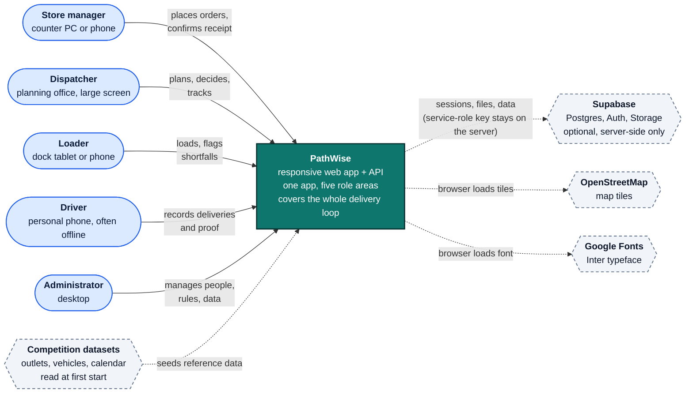
```mermaid
flowchart LR
  classDef person fill:#DBEAFE,stroke:#2563EB,stroke-width:1.5px,color:#0B1B3A
  classDef system fill:#0F766E,stroke:#042F2E,stroke-width:2px,color:#FFFFFF
  classDef ext fill:#F1F5F9,stroke:#64748B,stroke-width:1.5px,stroke-dasharray:5 4,color:#0F172A

  SM(["<b>Store manager</b><br/>counter PC or phone"]):::person
  DI(["<b>Dispatcher</b><br/>planning office, large screen"]):::person
  LO(["<b>Loader</b><br/>dock tablet or phone"]):::person
  DR(["<b>Driver</b><br/>personal phone, often offline"]):::person
  AD(["<b>Administrator</b><br/>desktop"]):::person

  PW["<b>PathWise</b><br/>responsive web app + API<br/>one app, five role areas<br/>covers the whole delivery loop"]:::system

  SB{{"<b>Supabase</b><br/>Postgres, Auth, Storage<br/>optional, server-side only"}}:::ext
  OSM{{"<b>OpenStreetMap</b><br/>map tiles"}}:::ext
  GF{{"<b>Google Fonts</b><br/>Inter typeface"}}:::ext
  DS{{"<b>Competition datasets</b><br/>outlets, vehicles, calendar<br/>read at first start"}}:::ext

  SM -- "places orders,<br/>confirms receipt" --> PW
  DI -- "plans, decides,<br/>tracks" --> PW
  LO -- "loads, flags<br/>shortfalls" --> PW
  DR -- "records deliveries<br/>and proof" --> PW
  AD -- "manages people,<br/>rules, data" --> PW
  PW -. "sessions, files, data<br/>(service-role key stays on the server)" .-> SB
  PW -. "browser loads tiles" .-> OSM
  PW -. "browser loads font" .-> GF
  DS -. "seeds reference data" .-> PW
```

#### Figure 2: Use cases

*What each role can do. Use cases are numbered to match the table below, and each traces to a user story the team wrote for the Designathon. The Administrator can also do everything a Dispatcher can. «include» means the use case always runs the other one; «extend» means it adds optional behaviour.*

| ID | Use case | Actor | Designathon story | Walkthrough step | Screen | Main endpoints |
|---|---|---|---|---|---|---|
| S1 | Place, change or cancel an order before the cutoff | Store manager | [Store 1](user_stories/Store_Manager_User_Stories.md) | 1 | `/s/order` | `GET /store/order-window` · `POST /store/orders` · `PATCH`, `DELETE /store/orders/:id` |
| S2 | See expected arrival and deferral notices | Store manager | Store 2, 3 | 1, 9 | `/s`, `/s/track`, `/s/deferrals` | `GET /store/overview` · `POST /store/deferrals/:id/ack` |
| S3 | Confirm receipt line by line, report issues | Store manager | Store 4 | 9 | `/s/receipt` | `GET /store/pod/:orderId` · `POST /store/receipts` |
| S4 | Review order and deferral history | Store manager | Store 5 | — | `/s/history` | `GET /store/history` |
| D1 | Review the confirmed queue | Dispatcher | [Dispatcher 1](user_stories/Dispatcher_User_Stories.md) | 2 | `/d`, `/d/orders` | `GET /overview` · `GET /orders` · `POST /orders/phone` |
| D2 | Auto-plan and adjust | Dispatcher | Dispatcher 2 | 2 | `/d/plan` | `POST /plans/:date/auto` · `POST /plans/:date/move` |
| D3 | Explain deferrals (forced or chosen) | Dispatcher | Dispatcher 3 | 2 | `/d/deferrals`, `/d/plan` | `GET /deferrals` · `GET /plans/:date` |
| D4 | Publish the plan and notify | Dispatcher | Dispatcher 4 | 2 | `/d/plan` | `POST /plans/:date/publish` · `GET /plans/:date/versions` |
| V1 | Validate against every rule | Included by D2, D4, D6 | [Loader 3](user_stories/Loader_User_Stories.md) (reuse of the Task 2B rules) | 2 | `/d/plan` | `validatePlan` in `@pathwise/core` |
| D5 | Track trips live | Dispatcher | Dispatcher 5 | 6 | `/d/tracking` | `GET /tracking` · `GET /trips/:id` |
| D6 | Resolve exceptions, move a stop | Dispatcher | Dispatcher 6 | 4, 6, 8 | `/d/exceptions`, `/d/tracking` | `POST /exceptions/:id/resolve` · `GET /trips/:id/move-options` · `POST /trips/:id/move-stop` |
| D7 | Forecast capacity, peak-day lab | Dispatcher | Dispatcher 7 | 10 | `/d/forecast`, `/d/peak-day` | `GET /forecast` · `GET /peak-day` |
| L1 | Receive the load list | Loader | Loader 1 | 3 | `/l` | `GET /loader/queue` · `POST /loader/trips/:id/claim` |
| L2 | Verify and tick the load | Loader | Loader 2 | 3 | `/l/trip/:id` | `POST /loader/trips/:id/lines/:orderId` |
| L3 | Flag shortfall, damage or fault | Loader | Loader 3 | 3, 4 | `/l/trip/:id` | `…/lines/:orderId/flag` · `…/size` · `…/fault` |
| L4 | Release the vehicle | Loader | Loader 4, 5 | 3, 4 | `/l/trip/:id` | `POST /loader/trips/:id/ack` · `…/release` |
| R1 | Receive the route and start | Driver | [Driver 1, 2](user_stories/Driver_User_Stories.md) | 5 | `/r` | `GET /driver/run` · `POST /driver/sync` |
| R2 | Record delivery with proof | Driver | Driver 3, 6 | 5, 7 | `/r` | `POST /driver/sync` (`arrived`, `delivered`) |
| R3 | Report a problem or delay | Driver | Driver 4 | 5 | `/r` | `POST /driver/sync` (`problem`) |
| R4 | Work offline and sync | Driver | Driver 5 | 5, 7, 8 | `/r` | `POST /driver/sync` (idempotent batch) |
| R5 | Close the trip | Driver | Driver 7 | 8 | `/r` | `POST /driver/sync` (`trip_closed`) |
| A1 | People and access | Administrator | — | 11 | `/a/people` | `/admin/users…` |
| A2 | Fleet, outlets, rules | Administrator | — | 11 | `/a/fleet`, `/a/outlets`, `/a/settings` | `/admin/vehicles` · `/admin/outlets` · `/admin/settings` |
| A3 | Data imports | Administrator | — | 11 | `/a/data` | `/admin/data` · `/admin/data/forecast` |
| A4 | Audit log and health | Administrator | — | 11 | `/a/audit`, `/a/system` | `/admin/audit` · `/admin/system` |
| X1 | Sign in | Everyone | — | all | `/login`, `/admin/login` | `POST /auth/login` · `/auth/pin` · `/auth/forgot` · `/auth/recover` |
| X2 | Receive live notifications | Everyone | — | all | bell in every shell | `GET /notifications` · `POST /events/ticket` · `GET /events` |

#### Figure 3: Closed-loop delivery workflow

*The booklet's seven stages, with PathWise as the hub. A decision made by one role reaches the next role without a phone call, and the driver's record gives the store something it can act on.*

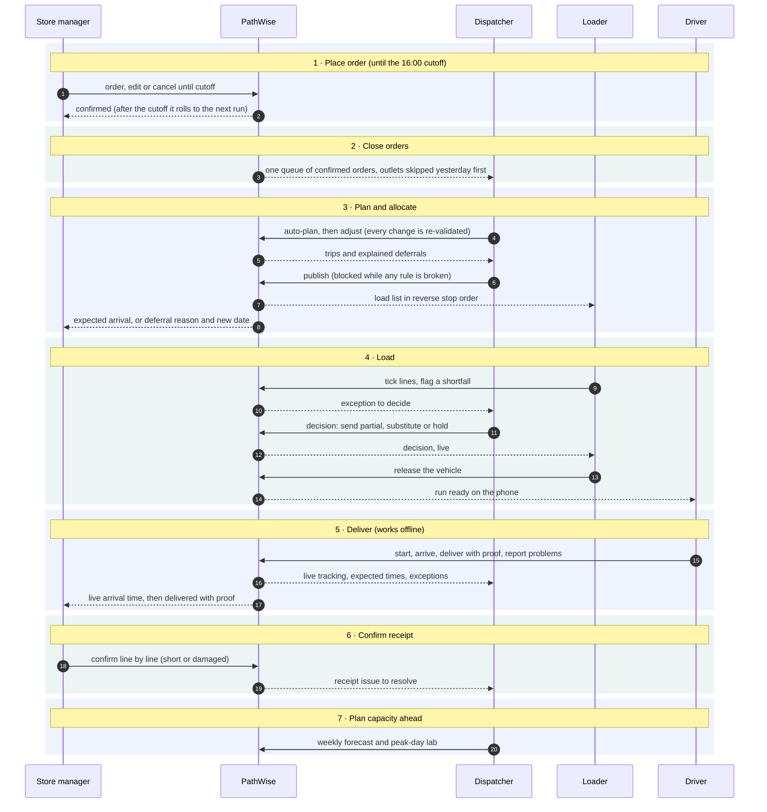
```mermaid
sequenceDiagram
  autonumber
  participant SM as Store manager
  participant PW as PathWise
  participant DI as Dispatcher
  participant LO as Loader
  participant DR as Driver

  rect rgba(37, 99, 235, 0.08)
    Note over SM,DR: 1 · Place order (until the 16:00 cutoff)
    SM->>PW: order, edit or cancel until cutoff
    PW-->>SM: confirmed (after the cutoff it rolls to the next run)
  end
  rect rgba(15, 118, 110, 0.08)
    Note over SM,DR: 2 · Close orders
    PW-->>DI: one queue of confirmed orders, outlets skipped yesterday first
  end
  rect rgba(37, 99, 235, 0.08)
    Note over SM,DR: 3 · Plan and allocate
    DI->>PW: auto-plan, then adjust (every change is re-validated)
    PW-->>DI: trips and explained deferrals
    DI->>PW: publish (blocked while any rule is broken)
    PW-->>LO: load list in reverse stop order
    PW-->>SM: expected arrival, or deferral reason and new date
  end
  rect rgba(15, 118, 110, 0.08)
    Note over SM,DR: 4 · Load
    LO->>PW: tick lines, flag a shortfall
    PW-->>DI: exception to decide
    DI->>PW: decision: send partial, substitute or hold
    PW-->>LO: decision, live
    LO->>PW: release the vehicle
    PW-->>DR: run ready on the phone
  end
  rect rgba(37, 99, 235, 0.08)
    Note over SM,DR: 5 · Deliver (works offline)
    DR->>PW: start, arrive, deliver with proof, report problems
    PW-->>DI: live tracking, expected times, exceptions
    PW-->>SM: live arrival time, then delivered with proof
  end
  rect rgba(15, 118, 110, 0.08)
    Note over SM,DR: 6 · Confirm receipt
    SM->>PW: confirm line by line (short or damaged)
    PW-->>DI: receipt issue to resolve
  end
  rect rgba(37, 99, 235, 0.08)
    Note over SM,DR: 7 · Plan capacity ahead
    DI->>PW: weekly forecast and peak-day lab
  end
```

## 3. Solution strategy

| Driver | Strategy | Where to look |
|---|---|---|
| Explainable, rule-correct plans | A pure domain library. Validate on every change and again on publish. Every deferral has a reason code, a *forced* or *chosen* kind and a store-facing sentence | [Fig 6](#figure-6-planning-engine-modules), [7](#figure-7-auto-plan-pipeline), [13](#figure-13-plan-validate-and-publish) |
| Offline field work | A local-first driver app: the run is cached on the phone, every action goes to an outbox first, sync is an idempotent batch, a conflict becomes a decision | [Fig 8](#figure-8-browser-internals), [15](#figure-15-driver-offline-run-and-sync), [18](#figure-18-driver-connectivity-states) |
| No drift between planner, validator and screens | One engine, called by the planner, the validator, the arrival-time model, the forecast and the Task 2B checker | [Fig 6](#figure-6-planning-engine-modules) |
| Security | API-fronted Supabase, the API's own short sessions with a revocable token version, role and scope on every route, zod on every input, row-level security on all 26 application tables, an append-only audit log | [Section 8](#8-cross-cutting-concepts), [Fig 16](#figure-16-sign-in-and-session), [23](#figure-23-security-layers) |
| One-command reproducibility | One image, automatic migrations, seed on an empty database, a health-checked PostgreSQL in Compose | [Fig 20](#figure-20-self-hosted-topologies), [21](#figure-21-boot-sequence) |
| Shared live awareness | Every write is audited, and the audit action decides which screens refetch, pushed over server-sent events | [Fig 17](#figure-17-live-updates) |
| Ten days, small team | One language end to end, plain SQL migrations, a modular monolith, optional managed Supabase | [Section 9](#9-architecture-decisions) |

## 4. Building blocks

| Block | Path | Responsibility | Built with |
|---|---|---|---|
| Planning engine | [`packages/core`](../packages/core) | Trip-time formula, `validatePlan` (every rule), `autoPlan` and deferral explanations, expected arrival times, weekly forecast, Task 2B checker, deterministic demo day | TypeScript, no runtime dependencies |
| API | [`apps/api`](../apps/api) | Authentication, role and scope guards, business clock, plan drafts and publishing, loading, driver sync, exceptions and decisions, notifications, audit, administration; serves the built web app | Fastify 5, `pg`, zod, jose, bcryptjs |
| Web app | [`apps/web`](../apps/web) | One PWA with five role areas (`/a /d /l /r /s`); the driver area is offline-first | React 19, Vite 6, Tailwind 4, TanStack Query 5, React Router 7, Leaflet, vite-plugin-pwa, idb-keyval |
| Database | [`apps/api/src/migrations`](../apps/api/src/migrations) | 26 tables from three versioned SQL migrations, row-level security on all 26 application tables, append-only `stop_events` and `audit_log` | PostgreSQL 16 (Compose, laptop) or Supabase |

#### Figure 4: Containers

*What runs where. The browser talks only to the PathWise API; the API serves the web app, so production has one origin and no CORS. The planning engine is a library inside the API process.*

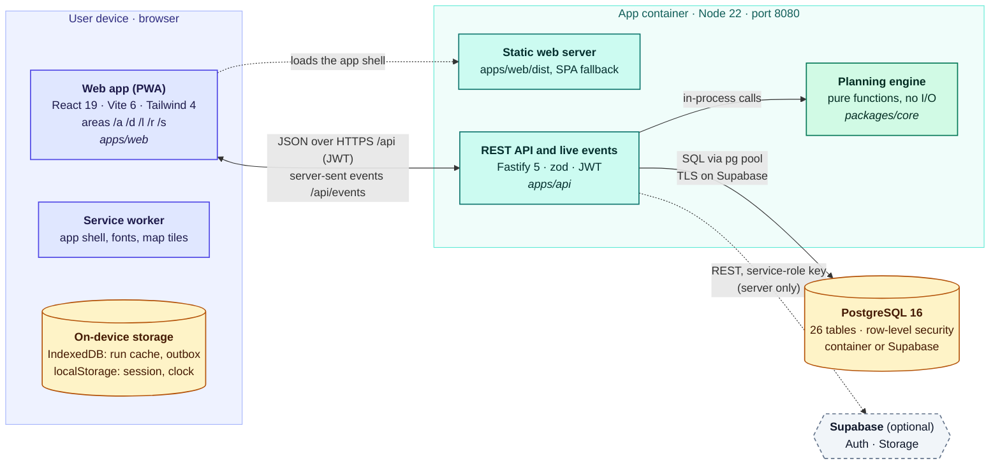
```mermaid
%%{init: {'flowchart': {'wrappingWidth': 380, 'nodeSpacing': 60, 'rankSpacing': 70}}}%%
flowchart LR
  classDef browser fill:#E0E7FF,stroke:#4F46E5,stroke-width:1.5px,color:#1E1B4B
  classDef server fill:#CCFBF1,stroke:#0F766E,stroke-width:1.5px,color:#042F2E
  classDef core fill:#D1FAE5,stroke:#047857,stroke-width:1.5px,color:#022C22
  classDef data fill:#FEF3C7,stroke:#B45309,stroke-width:1.5px,color:#451A03
  classDef ext fill:#F1F5F9,stroke:#64748B,stroke-width:1.5px,stroke-dasharray:5 4,color:#0F172A

  subgraph Device["User device · browser"]
    SPA["<b>Web app (PWA)</b><br/>React 19 · Vite 6 · Tailwind 4<br/>areas /a /d /l /r /s<br/><i>apps/web</i>"]:::browser
    SW["<b>Service worker</b><br/>app shell, fonts, map tiles"]:::browser
    DEV[("<b>On-device storage</b><br/>IndexedDB: run cache, outbox<br/>localStorage: session, clock")]:::data
  end
  subgraph Box["App container · Node 22 · port 8080"]
    WEB["<b>Static web server</b><br/>apps/web/dist, SPA fallback"]:::server
    API["<b>REST API and live events</b><br/>Fastify 5 · zod · JWT<br/><i>apps/api</i>"]:::server
    CORE["<b>Planning engine</b><br/>pure functions, no I/O<br/><i>packages/core</i>"]:::core
  end
  DB[("<b>PostgreSQL 16</b><br/>26 tables · row-level security<br/>container or Supabase")]:::data
  SB{{"<b>Supabase</b> (optional)<br/>Auth · Storage"}}:::ext

  SPA <-- "JSON over HTTPS /api (JWT)<br/>server-sent events /api/events" --> API
  SPA -. "loads the app shell" .-> WEB
  API -- "in-process calls" --> CORE
  API -- "SQL via pg pool<br/>TLS on Supabase" --> DB
  API -. "REST, service-role key<br/>(server only)" .-> SB

  style Device fill:#EEF2FF,stroke:#A5B4FC,color:#312E81
  style Box fill:#F0FDFA,stroke:#5EEAD4,color:#115E59
```

#### Figure 5: API internals

*Five layers, top to bottom, and the cross-cutting parts they share. Every state change runs in one transaction and ends with an audit entry, which also drives the live updates (Figure 17).*

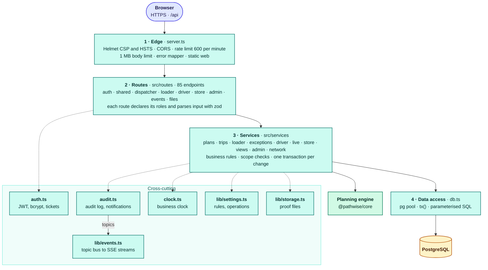
```mermaid
%%{init: {'flowchart': {'wrappingWidth': 420, 'nodeSpacing': 28, 'rankSpacing': 44}}}%%
flowchart TB
  classDef browser fill:#E0E7FF,stroke:#4F46E5,stroke-width:1.5px,color:#1E1B4B
  classDef server fill:#CCFBF1,stroke:#0F766E,stroke-width:1.5px,color:#042F2E
  classDef core fill:#D1FAE5,stroke:#047857,stroke-width:1.5px,color:#022C22
  classDef data fill:#FEF3C7,stroke:#B45309,stroke-width:1.5px,color:#451A03
  classDef ext fill:#F1F5F9,stroke:#64748B,stroke-width:1.5px,stroke-dasharray:5 4,color:#0F172A

  CL(["<b>Browser</b><br/>HTTPS · /api"]):::browser
  EDGE["<b>1 · Edge</b> · server.ts<br/>Helmet CSP and HSTS · CORS · rate limit 600 per minute<br/>1 MB body limit · error mapper · static web"]:::server
  ROUTES["<b>2 · Routes</b> · src/routes · 85 endpoints<br/>auth · shared · dispatcher · loader · driver · store · admin · events · files<br/>each route declares its roles and parses input with zod"]:::server
  SVC["<b>3 · Services</b> · src/services<br/>plans · trips · loader · exceptions · driver · live · store · views · admin · network<br/>business rules · scope checks · one transaction per change"]:::server
  DAL["<b>4 · Data access</b> · db.ts<br/>pg pool · tx() · parameterised SQL"]:::server
  PG[("<b>PostgreSQL</b>")]:::data

  subgraph X["Cross-cutting"]
    AUTH["<b>auth.ts</b><br/>JWT, bcrypt, tickets"]:::server
    AUD["<b>audit.ts</b><br/>audit log, notifications"]:::server
    BUS["<b>lib/events.ts</b><br/>topic bus to SSE streams"]:::server
    CLK["<b>clock.ts</b><br/>business clock"]:::server
    SET["<b>lib/settings.ts</b><br/>rules, operations"]:::server
    STO["<b>lib/storage.ts</b><br/>proof files"]:::server
  end
  CORE["<b>Planning engine</b><br/>@pathwise/core"]:::core

  CL --> EDGE --> ROUTES --> SVC --> DAL --> PG
  ROUTES -.-> AUTH
  SVC --> CORE
  SVC -.-> AUD
  SVC -.-> CLK
  SVC -.-> SET
  SVC -.-> STO
  AUD -- "topics" --> BUS

  style X fill:#F0FDFA,stroke:#5EEAD4,color:#115E59
```

The two driver endpoints (`GET /driver/run`, `POST /driver/sync`) carry the whole offline protocol. Endpoint counts by area: dispatcher 23, admin 23, loader 10, auth 9, store 9, shared 7, driver 2, events 1, files 1.

#### Figure 6: Planning engine modules

*What `@pathwise/core` contains. Arrows are imports. Trip time is computed in exactly one place (`schedule.ts`), so the planner, validator, arrival-time model and Task 2B checker cannot disagree. The web app does not import the engine: it receives its results from the API.*

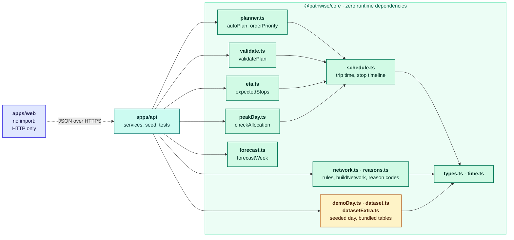
```mermaid
%%{init: {'flowchart': {'wrappingWidth': 320, 'nodeSpacing': 26, 'rankSpacing': 80}}}%%
flowchart LR
  classDef browser fill:#E0E7FF,stroke:#4F46E5,stroke-width:1.5px,color:#1E1B4B
  classDef server fill:#CCFBF1,stroke:#0F766E,stroke-width:1.5px,color:#042F2E
  classDef core fill:#D1FAE5,stroke:#047857,stroke-width:1.5px,color:#022C22
  classDef data fill:#FEF3C7,stroke:#B45309,stroke-width:1.5px,color:#451A03

  WEB["<b>apps/web</b><br/>no import:<br/>HTTP only"]:::browser
  API["<b>apps/api</b><br/>services, seed, tests"]:::server

  subgraph PKG["@pathwise/core · zero runtime dependencies"]
    PL["<b>planner.ts</b><br/>autoPlan, orderPriority"]:::core
    VA["<b>validate.ts</b><br/>validatePlan"]:::core
    ET["<b>eta.ts</b><br/>expectedStops"]:::core
    PD["<b>peakDay.ts</b><br/>checkAllocation"]:::core
    FC["<b>forecast.ts</b><br/>forecastWeek"]:::core
    SC["<b>schedule.ts</b><br/>trip time, stop timeline"]:::core
    TY["<b>types.ts</b> · <b>time.ts</b>"]:::core
    NW["<b>network.ts</b> · <b>reasons.ts</b><br/>rules, buildNetwork, reason codes"]:::core
    DD["<b>demoDay.ts</b> · <b>dataset.ts</b><br/><b>datasetExtra.ts</b><br/>seeded day, bundled tables"]:::data
  end

  WEB -. "JSON over HTTPS" .-> API
  API --> PL
  API --> VA
  API --> ET
  API --> PD
  API --> FC
  API --> NW
  API --> DD
  PL --> SC
  VA --> SC
  ET --> SC
  PD --> SC
  SC --> TY
  NW --> TY
  DD --> TY

  style PKG fill:#ECFDF5,stroke:#6EE7B7,color:#065F46
```

#### Figure 7: Auto-plan pipeline

*How demand becomes trips and explained deferrals ([`planner.ts`](../packages/core/src/planner.ts), detailed in [planning-engine.md](planning-engine.md)). Greedy, priority-first and deterministic, so every placement and every deferral has a reason.*

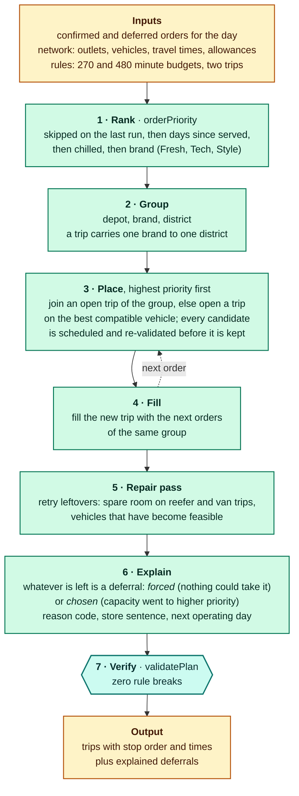
```mermaid
%%{init: {'flowchart': {'wrappingWidth': 560, 'nodeSpacing': 30, 'rankSpacing': 36}}}%%
flowchart TB
  classDef io fill:#FEF3C7,stroke:#B45309,stroke-width:1.5px,color:#451A03
  classDef step fill:#D1FAE5,stroke:#047857,stroke-width:1.5px,color:#022C22
  classDef gate fill:#CCFBF1,stroke:#0F766E,stroke-width:2px,color:#042F2E

  IN["<b>Inputs</b><br/>confirmed and deferred orders for the day<br/>network: outlets, vehicles, travel times, allowances<br/>rules: 270 and 480 minute budgets, two trips"]:::io
  S1["<b>1 · Rank</b> · orderPriority<br/>skipped on the last run, then days since served,<br/>then chilled, then brand (Fresh, Tech, Style)"]:::step
  S2["<b>2 · Group</b><br/>depot, brand, district<br/>a trip carries one brand to one district"]:::step
  S3["<b>3 · Place</b>, highest priority first<br/>join an open trip of the group, else open a trip<br/>on the best compatible vehicle; every candidate<br/>is scheduled and re-validated before it is kept"]:::step
  S4["<b>4 · Fill</b><br/>fill the new trip with the next orders<br/>of the same group"]:::step
  S5["<b>5 · Repair pass</b><br/>retry leftovers: spare room on reefer and van trips,<br/>vehicles that have become feasible"]:::step
  S6["<b>6 · Explain</b><br/>whatever is left is a deferral: <i>forced</i> (nothing could take it)<br/>or <i>chosen</i> (capacity went to higher priority)<br/>reason code, store sentence, next operating day"]:::step
  S7{{"<b>7 · Verify</b> · validatePlan<br/>zero rule breaks"}}:::gate
  OUT["<b>Output</b><br/>trips with stop order and times<br/>plus explained deferrals"]:::io

  IN --> S1 --> S2 --> S3 --> S4 --> S5 --> S6 --> S7 --> OUT
  S4 -. "next order" .-> S3
```

On the seeded demo day the engine serves 135 of 143 orders on 39 trips with zero rule breaks, and defers 8 chilled Fresh orders as `no_reefer_capacity`, kind *chosen*. It is not optimal by design (see [Section 11](#11-risks-limitations-and-evolution)).

#### Figure 8: Browser internals

*How the web app is organised, and how it stays usable offline. The service worker caches the shell, fonts and map tiles but never `/api`: API data is cached by the driver area itself, so stale data is never served silently.*

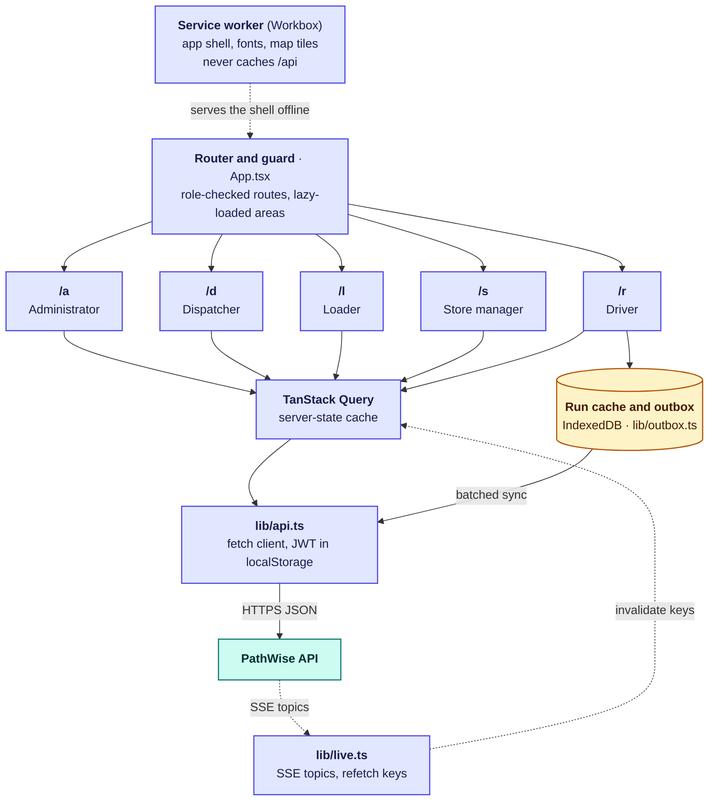
```mermaid
flowchart TB
  classDef browser fill:#E0E7FF,stroke:#4F46E5,stroke-width:1.5px,color:#1E1B4B
  classDef server fill:#CCFBF1,stroke:#0F766E,stroke-width:1.5px,color:#042F2E
  classDef data fill:#FEF3C7,stroke:#B45309,stroke-width:1.5px,color:#451A03

  SW["<b>Service worker</b> (Workbox)<br/>app shell, fonts, map tiles<br/>never caches /api"]:::browser
  RT["<b>Router and guard</b> · App.tsx<br/>role-checked routes, lazy-loaded areas"]:::browser
  A["<b>/a</b><br/>Administrator"]:::browser
  D["<b>/d</b><br/>Dispatcher"]:::browser
  L["<b>/l</b><br/>Loader"]:::browser
  R["<b>/r</b><br/>Driver"]:::browser
  S["<b>/s</b><br/>Store manager"]:::browser
  Q["<b>TanStack Query</b><br/>server-state cache"]:::browser
  OB[("<b>Run cache and outbox</b><br/>IndexedDB · lib/outbox.ts")]:::data
  API["<b>lib/api.ts</b><br/>fetch client, JWT in localStorage"]:::browser
  LV["<b>lib/live.ts</b><br/>SSE topics, refetch keys"]:::browser
  SRV["<b>PathWise API</b>"]:::server

  SW -. "serves the shell offline" .-> RT
  RT --> A & D & L & R & S
  A & D & L & S --> Q
  R --> Q
  R --> OB
  Q --> API
  OB -- "batched sync" --> API
  API -- "HTTPS JSON" --> SRV
  SRV -. "SSE topics" .-> LV
  LV -. "invalidate keys" .-> Q
```

## 5. Data

PostgreSQL 16 is the system of record. Three plain-SQL migrations create 26 tables; the full column-level model, with four domain views, is in [data-model.md](data-model.md).

#### Figure 9: Data architecture

*Where each kind of data lives and how it moves: the booklet's "how the system stores and connects its data". The database holds four groups of tables; large files go to the database or to a private bucket; the phone keeps its own copy of the run and an outbox.*

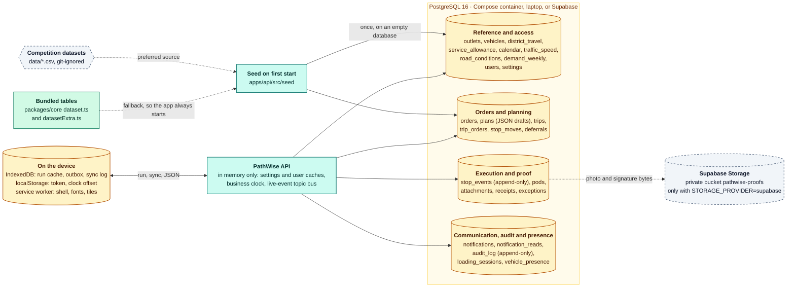
```mermaid
%%{init: {'flowchart': {'wrappingWidth': 330, 'nodeSpacing': 34, 'rankSpacing': 70}}}%%
flowchart LR
  classDef browser fill:#E0E7FF,stroke:#4F46E5,stroke-width:1.5px,color:#1E1B4B
  classDef server fill:#CCFBF1,stroke:#0F766E,stroke-width:1.5px,color:#042F2E
  classDef core fill:#D1FAE5,stroke:#047857,stroke-width:1.5px,color:#022C22
  classDef data fill:#FEF3C7,stroke:#B45309,stroke-width:1.5px,color:#451A03
  classDef ext fill:#F1F5F9,stroke:#64748B,stroke-width:1.5px,stroke-dasharray:5 4,color:#0F172A

  DEV[("<b>On the device</b><br/>IndexedDB: run cache, outbox, sync log<br/>localStorage: token, clock offset<br/>service worker: shell, fonts, tiles")]:::data
  API["<b>PathWise API</b><br/>in memory only: settings and user caches,<br/>business clock, live-event topic bus"]:::server

  CSV{{"<b>Competition datasets</b><br/>data/*.csv, git-ignored"}}:::ext
  BND["<b>Bundled tables</b><br/>packages/core dataset.ts<br/>and datasetExtra.ts"]:::core
  SEED["<b>Seed on first start</b><br/>apps/api/src/seed"]:::server

  subgraph PG["PostgreSQL 16 · Compose container, laptop, or Supabase"]
    G1[("<b>Reference and access</b><br/>outlets, vehicles, district_travel,<br/>service_allowance, calendar, traffic_speed,<br/>road_conditions, demand_weekly,<br/>users, settings")]:::data
    G2[("<b>Orders and planning</b><br/>orders, plans (JSON drafts), trips,<br/>trip_orders, stop_moves, deferrals")]:::data
    G3[("<b>Execution and proof</b><br/>stop_events (append-only), pods,<br/>attachments, receipts, exceptions")]:::data
    G4[("<b>Communication, audit and presence</b><br/>notifications, notification_reads,<br/>audit_log (append-only),<br/>loading_sessions, vehicle_presence")]:::data
  end
  BKT[("<b>Supabase Storage</b><br/>private bucket pathwise-proofs<br/>only with STORAGE_PROVIDER=supabase")]:::ext

  DEV <-- "run, sync, JSON" --> API
  CSV -. "preferred source" .-> SEED
  BND -. "fallback, so the app always starts" .-> SEED
  SEED -- "once, on an empty database" --> G1
  SEED --> G2
  API --> G1
  API --> G2
  API --> G3
  API --> G4
  G3 -. "photo and signature bytes" .-> BKT

  style PG fill:#FFFBEB,stroke:#FCD34D,color:#78350F
```

Three rules keep the data trustworthy. **Append-only** where history matters: `stop_events` and `audit_log` are never updated, and a phone record is stored even if it arrives late or conflicts. **Idempotent** where retries happen: `stop_events.client_event_id` is unique, so a record syncs once however often it is sent. **Private** where it is personal: proof photos are served only through `/api/files/:id` after an access check.

#### Figure 10: Domain model overview

*The delivery entities and how they relate. Users are scoped to one outlet (store manager) or one vehicle (driver), which is what every role and scope check rests on. Attributes, constraints and the remaining tables (notifications, audit, settings, reference data) are in [data-model.md](data-model.md).*

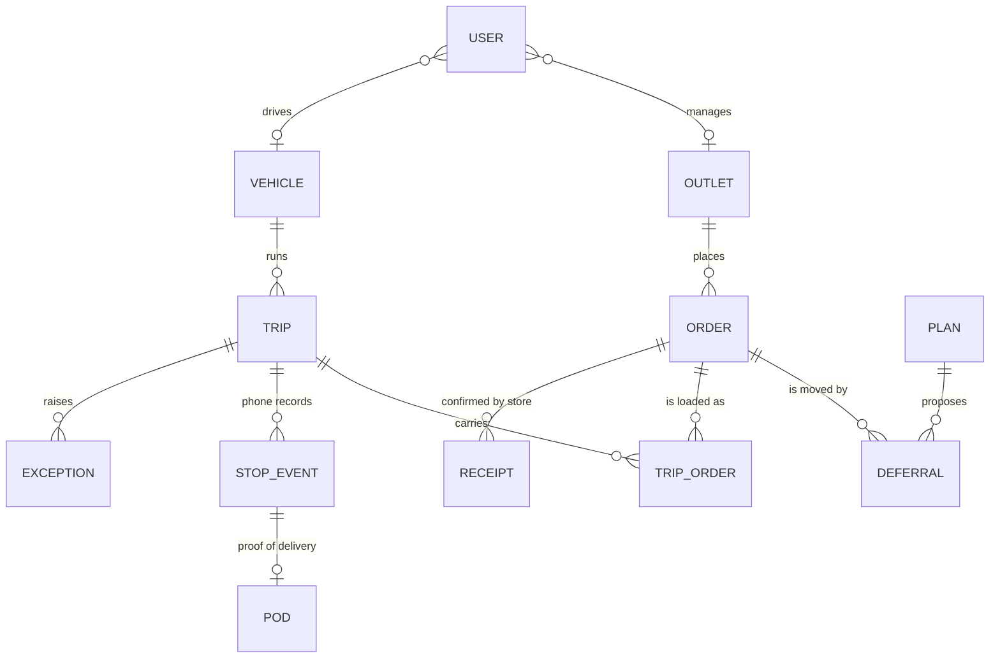
```mermaid
erDiagram
  OUTLET ||--o{ ORDER : places
  VEHICLE ||--o{ TRIP : runs
  PLAN ||--o{ DEFERRAL : proposes
  ORDER ||--o{ DEFERRAL : "is moved by"
  ORDER ||--o{ TRIP_ORDER : "is loaded as"
  TRIP ||--o{ TRIP_ORDER : carries
  TRIP ||--o{ STOP_EVENT : "phone records"
  STOP_EVENT ||--o| POD : "proof of delivery"
  ORDER ||--o{ RECEIPT : "confirmed by store"
  TRIP ||--o{ EXCEPTION : raises
  USER }o--o| OUTLET : "manages"
  USER }o--o| VEHICLE : "drives"
```

#### Figure 11: Order lifecycle

*The states of an order, exactly as the database allows them. The usual path runs along the top; deviations are explained by a decision, never by a silent change.*

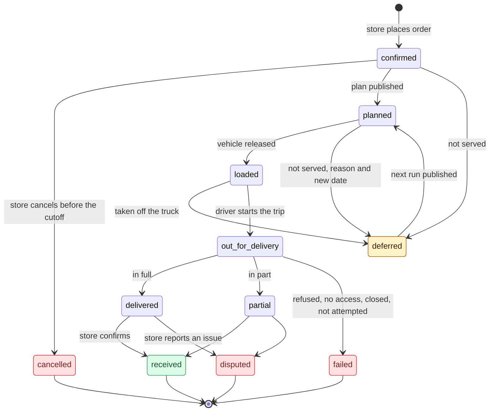
```mermaid
stateDiagram-v2
  direction TB
  [*] --> confirmed: store places order
  confirmed --> cancelled: store cancels before the cutoff
  confirmed --> planned: plan published
  confirmed --> deferred: not served
  planned --> loaded: vehicle released
  planned --> deferred: not served, reason and new date
  loaded --> deferred: taken off the truck
  deferred --> planned: next run published
  loaded --> out_for_delivery: driver starts the trip
  out_for_delivery --> delivered: in full
  out_for_delivery --> partial: in part
  out_for_delivery --> failed: refused, no access, closed, not attempted
  delivered --> received: store confirms
  delivered --> disputed: store reports an issue
  partial --> received
  partial --> disputed
  cancelled --> [*]
  received --> [*]
  disputed --> [*]
  failed --> [*]

  classDef good fill:#DCFCE7,stroke:#16A34A,color:#14532D
  classDef warn fill:#FEF3C7,stroke:#B45309,color:#451A03
  classDef bad fill:#FEE2E2,stroke:#DC2626,color:#7F1D1D
  class received good
  class deferred warn
  class cancelled,failed,disputed bad
```

A shortfall at the dock, a refused delivery and a receipt issue do not rewrite the original order: each creates a **child order** (`parent_order_id`) for the next operating day, with a *forced* deferral that carries the reason.

#### Figure 12: Trip lifecycle

*The states of a trip. A trip keeps its id across republishes, so loaders and drivers never lose their place.*

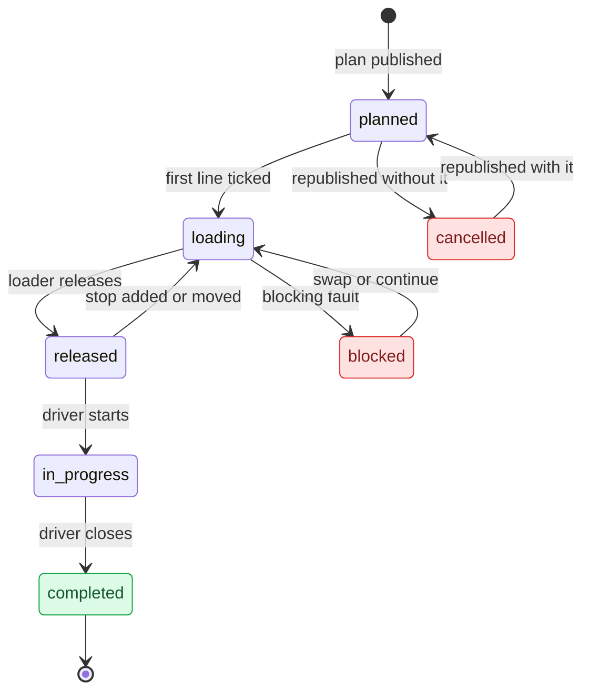
```mermaid
stateDiagram-v2
  direction TB
  [*] --> planned: plan published
  planned --> loading: first line ticked
  loading --> released: loader releases
  released --> in_progress: driver starts
  in_progress --> completed: driver closes
  loading --> blocked: blocking fault
  blocked --> loading: swap or continue
  released --> loading: stop added or moved
  planned --> cancelled: republished without it
  cancelled --> planned: republished with it
  completed --> [*]

  classDef good fill:#DCFCE7,stroke:#16A34A,color:#14532D
  classDef bad fill:#FEE2E2,stroke:#DC2626,color:#7F1D1D
  class completed good
  class blocked,cancelled bad
```

A blocking vehicle fault can be raised while a trip is planned, loading or released, and any trip left out of a republished plan is cancelled. Release is guarded: the API answers `409` until every line is loaded or flagged, no dispatcher decision is open for the trip, and any plan change has been acknowledged.

## 6. Runtime behaviour

#### Figure 13: Plan, validate and publish

*What happens between "Auto-plan" and a published plan. The same `validatePlan` runs on every change and again, on the server, at publish time, so a broken plan can never go live.*

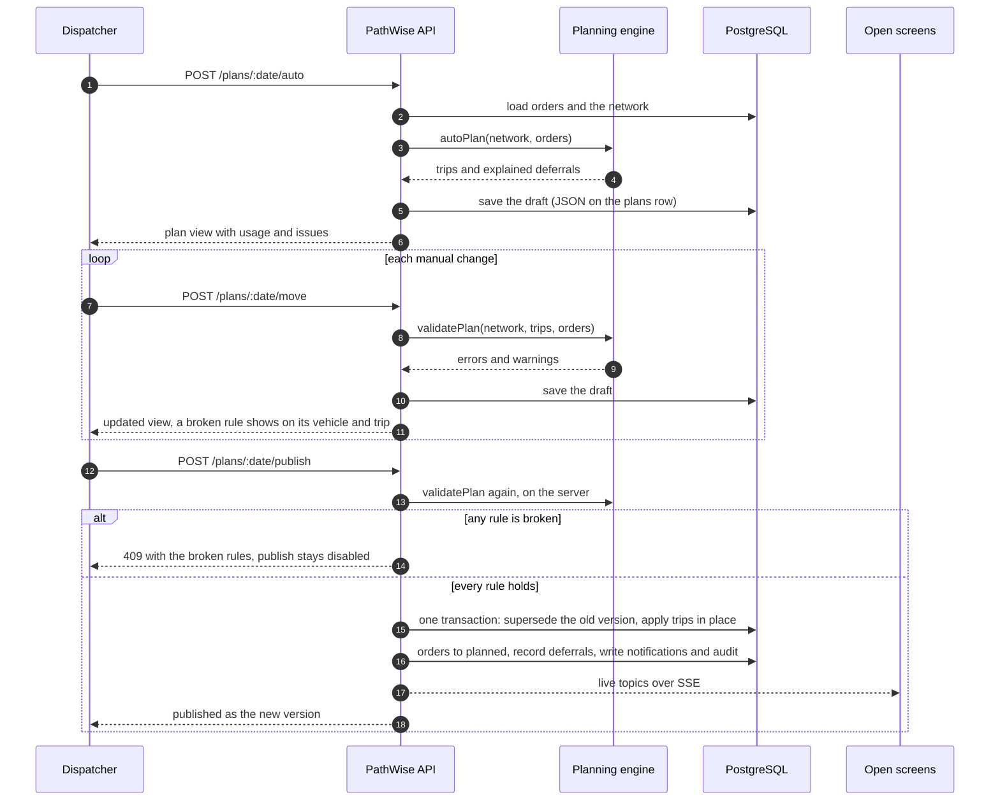
```mermaid
sequenceDiagram
  autonumber
  participant DI as Dispatcher
  participant API as PathWise API
  participant ENG as Planning engine
  participant DB as PostgreSQL
  participant SC as Open screens

  DI->>API: POST /plans/:date/auto
  API->>DB: load orders and the network
  API->>ENG: autoPlan(network, orders)
  ENG-->>API: trips and explained deferrals
  API->>DB: save the draft (JSON on the plans row)
  API-->>DI: plan view with usage and issues
  loop each manual change
    DI->>API: POST /plans/:date/move
    API->>ENG: validatePlan(network, trips, orders)
    ENG-->>API: errors and warnings
    API->>DB: save the draft
    API-->>DI: updated view, a broken rule shows on its vehicle and trip
  end
  DI->>API: POST /plans/:date/publish
  API->>ENG: validatePlan again, on the server
  alt any rule is broken
    API-->>DI: 409 with the broken rules, publish stays disabled
  else every rule holds
    API->>DB: one transaction: supersede the old version, apply trips in place
    API->>DB: orders to planned, record deferrals, write notifications and audit
    API-->>SC: live topics over SSE
    API-->>DI: published as the new version
  end
```

#### Figure 14: Loading at the dock

*How a shortfall travels from the loader to the dispatcher and back, and why the loader cannot release a vehicle on a wrong assumption.*

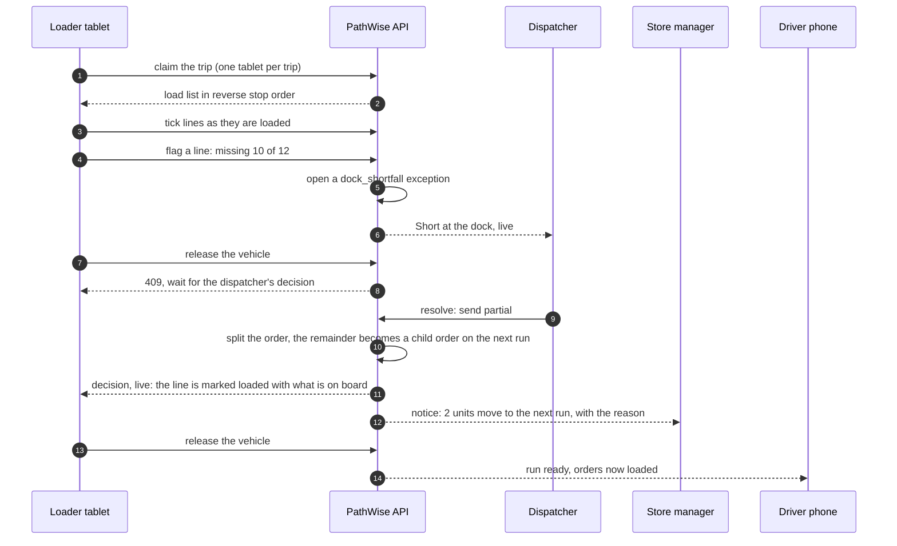
```mermaid
sequenceDiagram
  autonumber
  participant LO as Loader tablet
  participant API as PathWise API
  participant DI as Dispatcher
  participant SM as Store manager
  participant DR as Driver phone

  LO->>API: claim the trip (one tablet per trip)
  API-->>LO: load list in reverse stop order
  LO->>API: tick lines as they are loaded
  LO->>API: flag a line: missing 10 of 12
  API->>API: open a dock_shortfall exception
  API-->>DI: Short at the dock, live
  LO->>API: release the vehicle
  API-->>LO: 409, wait for the dispatcher's decision
  DI->>API: resolve: send partial
  API->>API: split the order, the remainder becomes a child order on the next run
  API-->>LO: decision, live: the line is marked loaded with what is on board
  API-->>SM: notice: 2 units move to the next run, with the reason
  LO->>API: release the vehicle
  API-->>DR: run ready, orders now loaded
```

#### Figure 15: Driver offline run and sync

*How records written with no signal are applied exactly once, and what happens when the dispatcher moved a stop in the meantime. A record is never discarded: a conflict becomes a decision.*

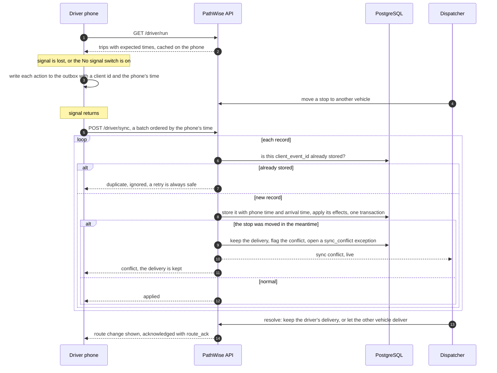
```mermaid
sequenceDiagram
  autonumber
  participant DR as Driver phone
  participant API as PathWise API
  participant DB as PostgreSQL
  participant DI as Dispatcher

  DR->>API: GET /driver/run
  API-->>DR: trips with expected times, cached on the phone
  Note over DR: signal is lost, or the No signal switch is on
  DR->>DR: write each action to the outbox with a client id and the phone's time
  DI->>API: move a stop to another vehicle
  Note over DR: signal returns
  DR->>API: POST /driver/sync, a batch ordered by the phone's time
  loop each record
    API->>DB: is this client_event_id already stored?
    alt already stored
      API-->>DR: duplicate, ignored, a retry is always safe
    else new record
      API->>DB: store it with phone time and arrival time, apply its effects, one transaction
      alt the stop was moved in the meantime
        API->>DB: keep the delivery, flag the conflict, open a sync_conflict exception
        API-->>DI: sync conflict, live
        API-->>DR: conflict, the delivery is kept
      else normal
        API-->>DR: applied
      end
    end
  end
  DI->>API: resolve: keep the driver's delivery, or let the other vehicle deliver
  API-->>DR: route change shown, acknowledged with route_ack
```

#### Figure 16: Sign-in and session

*How people are authenticated and how a session is ended centrally. The API issues its own short sessions, so a Supabase outage does not sign anyone out.*

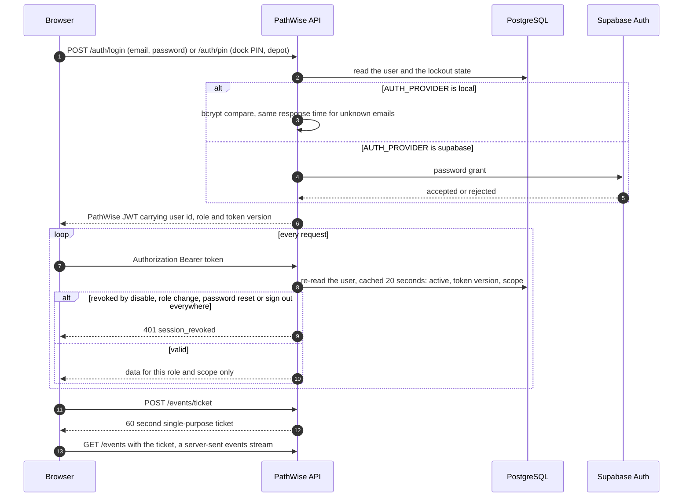
```mermaid
sequenceDiagram
  autonumber
  participant BR as Browser
  participant API as PathWise API
  participant DB as PostgreSQL
  participant SA as Supabase Auth

  BR->>API: POST /auth/login (email, password) or /auth/pin (dock PIN, depot)
  API->>DB: read the user and the lockout state
  alt AUTH_PROVIDER is local
    API->>API: bcrypt compare, same response time for unknown emails
  else AUTH_PROVIDER is supabase
    API->>SA: password grant
    SA-->>API: accepted or rejected
  end
  API-->>BR: PathWise JWT carrying user id, role and token version
  loop every request
    BR->>API: Authorization Bearer token
    API->>DB: re-read the user, cached 20 seconds: active, token version, scope
    alt revoked by disable, role change, password reset or sign out everywhere
      API-->>BR: 401 session_revoked
    else valid
      API-->>BR: data for this role and scope only
    end
  end
  BR->>API: POST /events/ticket
  API-->>BR: 60 second single-purpose ticket
  BR->>API: GET /events with the ticket, a server-sent events stream
```

#### Figure 17: Live updates

*How one write reaches every open screen. The audit action decides which screens are stale, so each browser refetches only what changed. Polling stays as the fallback.*

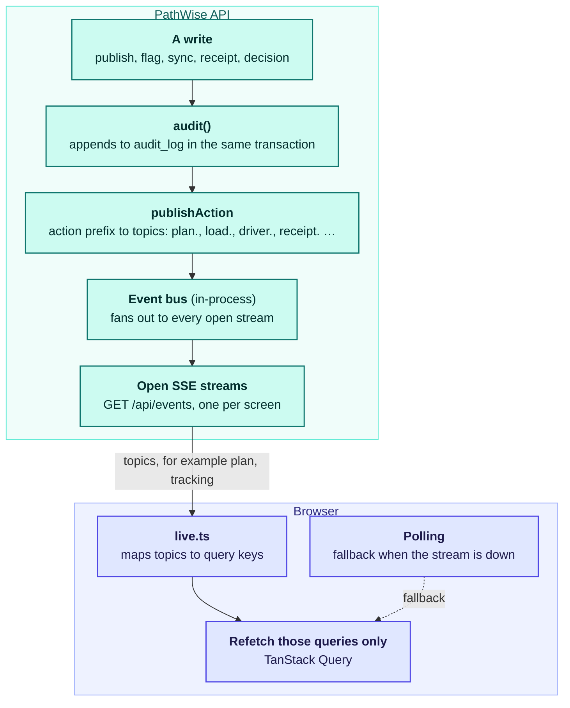
```mermaid
%%{init: {'flowchart': {'wrappingWidth': 380, 'nodeSpacing': 30, 'rankSpacing': 34}}}%%
flowchart TB
  classDef browser fill:#E0E7FF,stroke:#4F46E5,stroke-width:1.5px,color:#1E1B4B
  classDef server fill:#CCFBF1,stroke:#0F766E,stroke-width:1.5px,color:#042F2E

  subgraph SRV["PathWise API"]
    W["<b>A write</b><br/>publish, flag, sync, receipt, decision"]:::server
    AU["<b>audit()</b><br/>appends to audit_log in the same transaction"]:::server
    MAP["<b>publishAction</b><br/>action prefix to topics: plan., load., driver., receipt. …"]:::server
    BUS["<b>Event bus</b> (in-process)<br/>fans out to every open stream"]:::server
    SSE["<b>Open SSE streams</b><br/>GET /api/events, one per screen"]:::server
    W --> AU --> MAP --> BUS --> SSE
  end
  subgraph BRW["Browser"]
    LV["<b>live.ts</b><br/>maps topics to query keys"]:::browser
    RQ["<b>Refetch those queries only</b><br/>TanStack Query"]:::browser
    POLL["<b>Polling</b><br/>fallback when the stream is down"]:::browser
    LV --> RQ
    POLL -. "fallback" .-> RQ
  end
  SSE -- "topics, for example plan, tracking" --> LV

  style SRV fill:#F0FDFA,stroke:#5EEAD4,color:#115E59
  style BRW fill:#EEF2FF,stroke:#A5B4FC,color:#312E81
```

#### Figure 18: Driver connectivity states

*What the driver app does as signal comes and goes. The run and the outbox live in IndexedDB, so they survive a reload with no signal. The same states can be demonstrated on any phone with the No signal switch.*

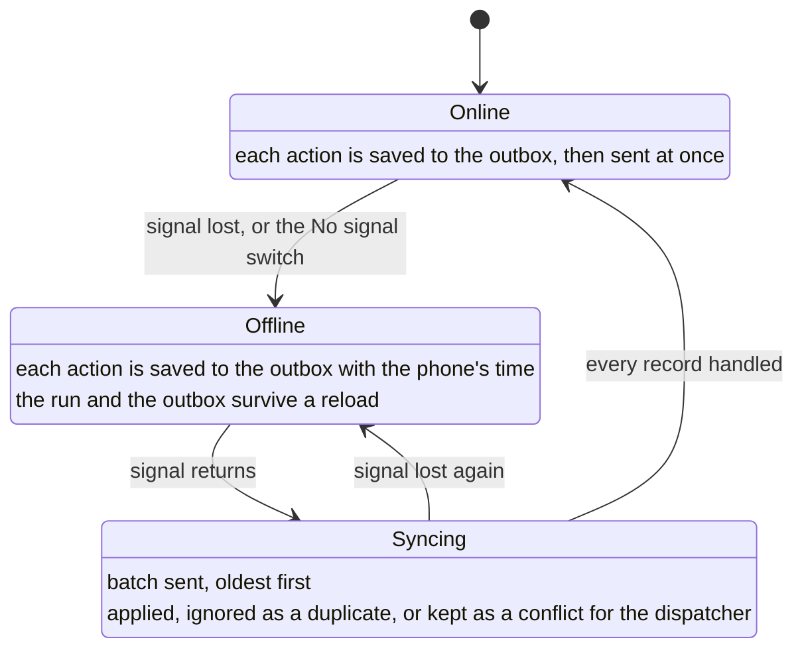
```mermaid
stateDiagram-v2
  direction TB
  [*] --> Online
  Online --> Offline: signal lost, or the No signal switch
  Offline --> Syncing: signal returns
  Syncing --> Online: every record handled
  Syncing --> Offline: signal lost again

  Online: Online
  Online: each action is saved to the outbox, then sent at once
  Offline: Offline
  Offline: each action is saved to the outbox with the phone's time
  Offline: the run and the outbox survive a reload
  Syncing: Syncing
  Syncing: batch sent, oldest first
  Syncing: applied, ignored as a duplicate, or kept as a conflict for the dispatcher
```

## 7. Deployment

One image runs everywhere; only environment variables change. The live demo runs on **Railway** against a **Supabase** project. The same image runs under `docker compose`, on a laptop with only Node.js, or on any Docker host (a Render Blueprint is included in `render.yaml`).

| Mode | How to start | Database | Ports | For |
|---|---|---|---|---|
| Docker Compose | `docker compose up --build` | `postgres:16-alpine` container, volume `pgdata`, health-checked | App on **8080** (host port `APP_PORT`, default 8080) | Judges, any machine with Docker |
| Laptop, Node.js only | `npm install`, then `npm run local` | Embedded PostgreSQL in `./.pgdata` | App on **8080** (`PORT`); database on 5499 | No Docker, no database install |
| Development | `npm run dev` with a `.env` copied from `.env.example` | Your PostgreSQL or Supabase | API on **3000** (`PORT` in `.env.example`); web dev server on **5173**, proxying `/api` to 3000 | Working on the code |
| Production | The `Dockerfile` image on Railway (live), or any Docker host | Supabase Postgres, session pooler, TLS | Container on **8080**; the platform terminates TLS | The live demo |

#### Figure 19: Production deployment

*What runs in production and where the trust boundaries are. Secrets exist only in the platform's environment; the browser holds a short-lived PathWise token and nothing else.*

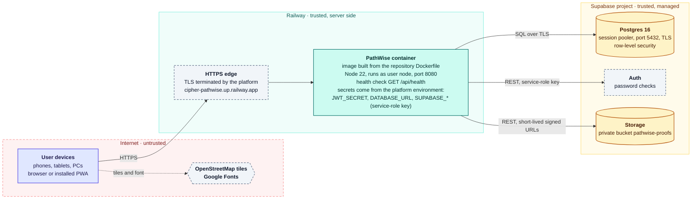
```mermaid
%%{init: {'flowchart': {'wrappingWidth': 400, 'nodeSpacing': 36, 'rankSpacing': 90}}}%%
flowchart LR
  classDef browser fill:#E0E7FF,stroke:#4F46E5,stroke-width:1.5px,color:#1E1B4B
  classDef server fill:#CCFBF1,stroke:#0F766E,stroke-width:1.5px,color:#042F2E
  classDef data fill:#FEF3C7,stroke:#B45309,stroke-width:1.5px,color:#451A03
  classDef ext fill:#F1F5F9,stroke:#64748B,stroke-width:1.5px,stroke-dasharray:5 4,color:#0F172A

  subgraph NET["Internet · untrusted"]
    USR["<b>User devices</b><br/>phones, tablets, PCs<br/>browser or installed PWA"]:::browser
    CDN{{"<b>OpenStreetMap tiles</b><br/><b>Google Fonts</b>"}}:::ext
  end
  subgraph RW["Railway · trusted, server side"]
    EDGE["<b>HTTPS edge</b><br/>TLS terminated by the platform<br/>cipher-pathwise.up.railway.app"]:::ext
    APP["<b>PathWise container</b><br/>image built from the repository Dockerfile<br/>Node 22, runs as user node, port 8080<br/>health check GET /api/health<br/>secrets come from the platform environment:<br/>JWT_SECRET, DATABASE_URL, SUPABASE_* (service-role key)"]:::server
  end
  subgraph SUP["Supabase project · trusted, managed"]
    PGS[("<b>Postgres 16</b><br/>session pooler, port 5432, TLS<br/>row-level security")]:::data
    AUT["<b>Auth</b><br/>password checks"]:::ext
    STG[("<b>Storage</b><br/>private bucket pathwise-proofs")]:::data
  end

  USR -- "HTTPS" --> EDGE
  EDGE --> APP
  USR -. "tiles and font" .-> CDN
  APP -- "SQL over TLS" --> PGS
  APP -- "REST, service-role key" --> AUT
  APP -- "REST, short-lived signed URLs" --> STG

  style NET fill:#FEF2F2,stroke:#F87171,stroke-dasharray:6 4,color:#7F1D1D
  style RW fill:#F0FDFA,stroke:#5EEAD4,color:#115E59
  style SUP fill:#FFFBEB,stroke:#FCD34D,color:#78350F
```

#### Figure 20: Self-hosted topologies

*The two ways to run the stack without a hosting platform. Both serve the same app on port 8080.*

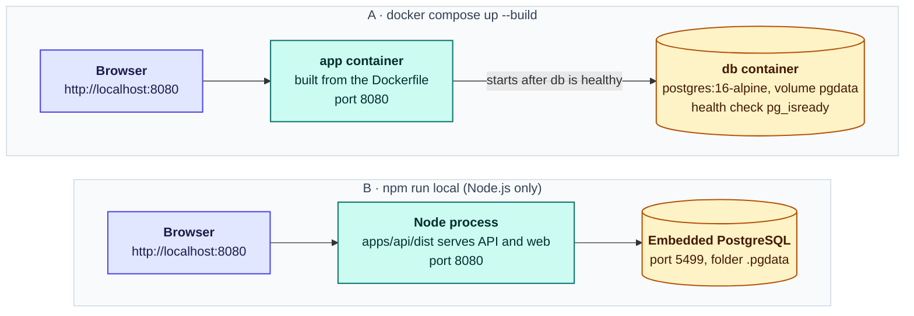
```mermaid
%%{init: {'flowchart': {'wrappingWidth': 260, 'nodeSpacing': 30, 'rankSpacing': 60}}}%%
flowchart LR
  classDef browser fill:#E0E7FF,stroke:#4F46E5,stroke-width:1.5px,color:#1E1B4B
  classDef server fill:#CCFBF1,stroke:#0F766E,stroke-width:1.5px,color:#042F2E
  classDef data fill:#FEF3C7,stroke:#B45309,stroke-width:1.5px,color:#451A03

  subgraph B["B · npm run local (Node.js only)"]
    direction LR
    B2["<b>Browser</b><br/>http://localhost:8080"]:::browser
    NODE["<b>Node process</b><br/>apps/api/dist serves API and web<br/>port 8080"]:::server
    EMB[("<b>Embedded PostgreSQL</b><br/>port 5499, folder .pgdata")]:::data
    B2 --> NODE
    NODE --> EMB
  end
  subgraph A["A · docker compose up --build"]
    direction LR
    B1["<b>Browser</b><br/>http://localhost:8080"]:::browser
    APPA["<b>app container</b><br/>built from the Dockerfile<br/>port 8080"]:::server
    DBA[("<b>db container</b><br/>postgres:16-alpine, volume pgdata<br/>health check pg_isready")]:::data
    B1 --> APPA
    APPA -- "starts after db is healthy" --> DBA
  end

  style A fill:#F8FAFC,stroke:#CBD5E1,color:#334155
  style B fill:#F8FAFC,stroke:#CBD5E1,color:#334155
```

#### Figure 21: Boot sequence

*What `docker compose up` does after the image starts ([`apps/api/src/index.ts`](../apps/api/src/index.ts)). It is why a fresh clone needs no manual setup, and why a restart is safe: migrations are tracked and seeding runs only on an empty database.*

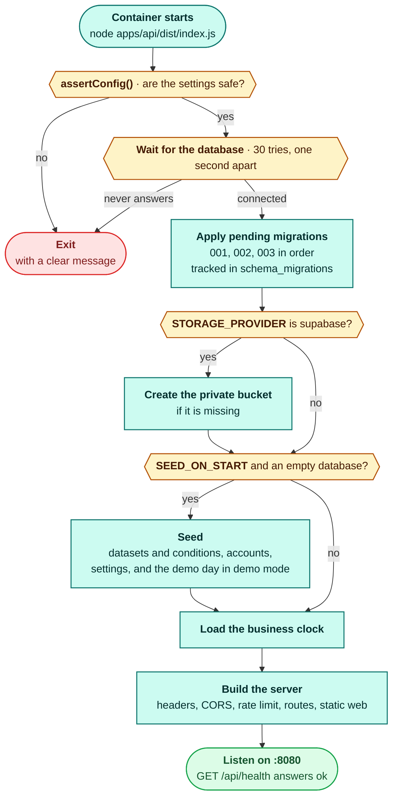
```mermaid
%%{init: {'flowchart': {'wrappingWidth': 320, 'nodeSpacing': 34, 'rankSpacing': 36}}}%%
flowchart TB
  classDef step fill:#CCFBF1,stroke:#0F766E,stroke-width:1.5px,color:#042F2E
  classDef gate fill:#FEF3C7,stroke:#B45309,stroke-width:1.5px,color:#451A03
  classDef stop fill:#FEE2E2,stroke:#DC2626,stroke-width:1.5px,color:#7F1D1D
  classDef ok fill:#DCFCE7,stroke:#16A34A,stroke-width:1.5px,color:#14532D

  START(["<b>Container starts</b><br/>node apps/api/dist/index.js"]):::step
  CFG{{"<b>assertConfig()</b> · are the settings safe?"}}:::gate
  BAD(["<b>Exit</b><br/>with a clear message"]):::stop
  DBW{{"<b>Wait for the database</b> · 30 tries, one second apart"}}:::gate
  MIG["<b>Apply pending migrations</b><br/>001, 002, 003 in order<br/>tracked in schema_migrations"]:::step
  BKT{{"<b>STORAGE_PROVIDER</b> is supabase?"}}:::gate
  BK["<b>Create the private bucket</b><br/>if it is missing"]:::step
  SEED{{"<b>SEED_ON_START</b> and an empty database?"}}:::gate
  SD["<b>Seed</b><br/>datasets and conditions, accounts,<br/>settings, and the demo day in demo mode"]:::step
  CLK["<b>Load the business clock</b>"]:::step
  SRV["<b>Build the server</b><br/>headers, CORS, rate limit, routes, static web"]:::step
  LST(["<b>Listen on :8080</b><br/>GET /api/health answers ok"]):::ok

  START --> CFG
  CFG -- "no" --> BAD
  CFG -- "yes" --> DBW
  DBW -- "never answers" --> BAD
  DBW -- "connected" --> MIG --> BKT
  BKT -- "yes" --> BK --> SEED
  BKT -- "no" --> SEED
  SEED -- "yes" --> SD --> CLK
  SEED -- "no" --> CLK
  CLK --> SRV --> LST
```

#### Figure 22: CI pipeline

*What is checked on every push and pull request ([`.github/workflows/ci.yml`](../.github/workflows/ci.yml)). The two jobs run in parallel: one proves the code, the other proves the one-command start.*

```mermaid
%%{init: {'flowchart': {'wrappingWidth': 300, 'nodeSpacing': 30, 'rankSpacing': 36}}}%%
flowchart LR
  classDef ops fill:#EDE9FE,stroke:#7C3AED,stroke-width:1.5px,color:#2E1065
  classDef step fill:#CCFBF1,stroke:#0F766E,stroke-width:1.5px,color:#042F2E
  classDef ok fill:#DCFCE7,stroke:#16A34A,stroke-width:1.5px,color:#14532D

  EV(["<b>push or pull request</b>"]):::ops
  subgraph J1["job test · ubuntu-latest · PostgreSQL 16 service"]
    T1["<b>checkout, Node 22, npm ci</b><br/>npm cache"]:::step
    T2["<b>npm run build</b>"]:::step
    T3["<b>npm run typecheck</b>"]:::step
    T4["<b>Engine tests</b><br/>pure, no database"]:::step
    T5["<b>API tests</b><br/>real PostgreSQL, full walkthrough"]:::step
    T1 --> T2 --> T3 --> T4 --> T5
  end
  subgraph J2["job docker · ubuntu-latest"]
    D1["<b>checkout</b>"]:::step
    D2["<b>docker compose up -d --build</b>"]:::step
    D3["<b>Poll GET /api/health</b><br/>up to 60 times, 3 s apart"]:::step
    D4["<b>Login smoke test</b><br/>the dispatcher receives a token"]:::step
    D5["<b>Print app logs</b><br/>always"]:::step
    D1 --> D2 --> D3 --> D4 --> D5
  end
  OK(["<b>Status on the commit</b><br/>and the README badge"]):::ok

  EV --> T1
  EV --> D1
  T5 --> OK
  D5 --> OK

  style J1 fill:#F5F3FF,stroke:#C4B5FD,color:#4C1D95
  style J2 fill:#F5F3FF,stroke:#C4B5FD,color:#4C1D95
```

**Switches that change the topology.** Everything else is a tuning value; the full reference is in the [README](../README.md#setup--configuration) and [`.env.example`](../.env.example).

| Variable | Local default | Production | Effect |
|---|---|---|---|
| `DATABASE_URL`, `DATABASE_SSL` | Compose database, no TLS | Supabase session pooler, TLS on | Where data lives |
| `AUTH_PROVIDER` | `local` (bcrypt in `users`) | `supabase` | Who checks passwords |
| `STORAGE_PROVIDER` | `db` (photos in PostgreSQL) | `supabase` (private bucket) | Where proof photos live |
| `DEMO_MODE`, `SEED_ON_START` | `true`, `true` | `true` for judging, `false` for a real rollout | Demo accounts, the business clock, reset; seeding on an empty database |
| `TRUST_PROXY` | `false` | `true` behind the platform proxy | Real client address for rate limits and audit |
| `JWT_SECRET` | Placeholder (warns) | Random, 32+ characters | Signs sessions; must be strong when `DEMO_MODE=false` |

## 8. Cross-cutting concepts

### 8.1 Security

#### Figure 23: Security layers

*Six controls between a request and the data. The browser is the only untrusted party: it holds a short-lived PathWise token and no Supabase key. Details are in [security.md](security.md).*

```mermaid
%%{init: {'flowchart': {'wrappingWidth': 420, 'nodeSpacing': 30, 'rankSpacing': 34}}}%%
flowchart TB
  classDef browser fill:#E0E7FF,stroke:#4F46E5,stroke-width:1.5px,color:#1E1B4B
  classDef server fill:#CCFBF1,stroke:#0F766E,stroke-width:1.5px,color:#042F2E
  classDef data fill:#FEF3C7,stroke:#B45309,stroke-width:1.5px,color:#451A03

  subgraph UNT["Untrusted · Internet"]
    BR["<b>Browser</b><br/>short-lived PathWise token only,<br/>never a Supabase key"]:::browser
  end
  subgraph TRU["Trusted · server side"]
    L1["<b>1 · Transport and headers</b><br/>TLS and HSTS, strict CSP, frame-ancestors none,<br/>same-origin CORS, rate limits (600 per minute, sign-in stricter)"]:::server
    L2["<b>2 · Authentication</b><br/>HS256 session with a token version re-checked on every request,<br/>bcrypt cost 12, lockout after 5 misses for 15 minutes, optional Supabase Auth"]:::server
    L3["<b>3 · Authorization</b><br/>a role guard on every route, plus scope checks in the services<br/>(depot, outlet, vehicle); a wrong scope answers not found"]:::server
    L4["<b>4 · Input validation</b><br/>zod on every body, query and path parameter,<br/>parameterised SQL only"]:::server
    L5["<b>5 · Data protection</b><br/>row-level security on all 26 application tables, private files behind an access check,<br/>service-role key only in the server environment"]:::data
    L6["<b>6 · Audit</b><br/>every write recorded in an append-only log with who and when,<br/>secrets and image data redacted"]:::data
  end
  BR -- "HTTPS" --> L1 --> L2 --> L3 --> L4 --> L5
  L4 -.-> L6

  style UNT fill:#FEF2F2,stroke:#F87171,stroke-dasharray:6 4,color:#7F1D1D
  style TRU fill:#F0FDFA,stroke:#5EEAD4,color:#115E59
```

### 8.2 Resilience: what happens when something fails

Each failure mode below is designed for, implemented and described step by step in [degradation.md](degradation.md).

| Failure | What the user sees | What the system does | Detail |
|---|---|---|---|
| Driver loses signal | The run stays on screen; deliveries show *Saved on phone · waiting to sync* | Outbox in IndexedDB; sync later, exactly once | §A |
| A stop is moved while the phone is offline | After sync: *Your route changed* and *Check one stop* | The delivery is kept as a conflict; the dispatcher decides | §B |
| Shortfall at the dock | Release stays locked until a decision | Exception raised; send partial, substitute or hold | §C |
| Vehicle fault before departure | The trip is blocked | The dispatcher swaps the vehicle | §D |
| Store closed, refuses or cannot be reached | The driver records the outcome with a photo or note | Exception; return to depot or retry today | §E |
| Store finds a problem on receipt | A line marked short, damaged or too warm | Exception; replace on the next run or credit | §F |
| Plan changes while loading | A banner the loader must acknowledge | `changed_at` and acknowledgement before release | §G |
| Demand is higher than capacity | Deferral notices with the reason | Forced or chosen deferrals; repeat-skip protection | §H |
| Supabase unavailable | Signed-in users carry on; sign-in or photo upload says why it failed | PathWise issues its own sessions | §N |
| Server or database unreachable | Field apps work from cache and queue; screens show they are offline | Reconnect with polling as the fallback | §O |

### 8.3 Observability and audit

Structured request logs (Fastify's logger, with authorization headers, cookies and event tickets redacted) go to the platform. `GET /api/health` backs the container health check; **Administration → System health** shows the database, applied migrations, row-level security and Supabase state. Every write is recorded in `audit_log` and is browsable and filterable by an administrator.

### 8.4 Business clock

The demo day is Thursday 30 April 2026. A settings row stores `{base, setAt}`, and "now" is `base + (wall clock − setAt)`, so time runs in real time from 02:30 and the dispatcher can jump it to any step of the walkthrough. Every client keeps the offset, so phones stamp offline records in business time. Setting and resetting the clock exist only in demo mode.

### 8.5 Notifications by audience

A notification is addressed to `role:`, `depot:`, `outlet:`, `vehicle:` or `user:`, and each user reads the union of their audiences. "Tell the Kandy loaders" or "tell whoever drives VEH041" is one insert, and it survives vehicle swaps.

### 8.6 Error model

Errors are `{ error, code, details }`, where `error` is a sentence a person can act on. `400` is bad input (zod, with per-field details), `401` a missing or ended session, `403` the wrong role or a pending password change, `404` out of scope or unknown, `409` a business rule (for example release before everything is loaded), `423` a locked account, `429` a rate limit. Database constraint violations are mapped to data errors, never to crashes, and stack traces stay in the server log.

### 8.7 Test strategy

| Layer | What | Count |
|---|---|---|
| Planning engine | Pure unit tests on the seeded day: trip-time worked example (101 min), validator, auto-plan (zero rule breaks, explained deferrals, repeat-skip protection), expected arrival times, forecast, Task 2B checker, and a **golden snapshot** that fails if any planning decision changes | 29 |
| API | The whole judge walkthrough end to end on real PostgreSQL; accounts, roles, settings, audit and operations safety rules; mocked Supabase Auth and Storage with row-level security checks; database-free unit tests | 39 |
| Pipeline | Build, type-check, both suites, and a `docker compose` health and login smoke test on every push | CI |
| Web app | Type-checked in CI; the judge walkthrough is its acceptance test. There are no automated UI tests | — |

## 9. Architecture decisions

Each decision records what was chosen, why, what was not chosen, and what it costs.

| # | Decision | Why | Not chosen | Consequence |
|---|---|---|---|---|
| 1 | **One TypeScript monorepo** with npm workspaces | One toolchain, shared understanding, atomic changes across engine, API and web in ten days | Several repositories or languages | Web and API are released together |
| 2 | **The planning engine is a pure library** (`@pathwise/core`: no I/O, no clock) | Deterministic and testable (golden snapshot); reused by planner, validator, arrival times, forecast and checker | Planning inside SQL or in a separate solver service | The network (120 outlets, 60 vehicles) is loaded into memory per call, which is trivial at this size |
| 3 | **Greedy, priority-first planner with a repair pass** | Explainable, deterministic and fast: every placement and deferral has a reason | ILP or CP-SAT, metaheuristics | Not optimal; the validator still guarantees feasibility, and a local-search step is the natural next improvement |
| 4 | **Plan time and expected time are separate** | The booklet formula is the planning standard (free flow); expected arrival adds traffic, road conditions and reported holds | One model for both | Two times on screen, each clearly labelled |
| 5 | **Drafts are JSON on the `plans` row; publishing applies them in place with stable trip ids** | Free edits and cheap discard; loaders and drivers keep their trip identity; changed trips are flagged | Versioned trip tables, a full copy per version | Draft validity is enforced in code, not by the database; every version is kept (`superseded`) |
| 6 | **Plain SQL migrations and `pg`, no ORM** | Constraints, triggers and row-level security are written directly and are easy to review | ORM with generated migrations | Manual row mapping, guarded by zod and typed rows |
| 7 | **Supabase behind the API** | Business rules and the service-role key stay on the server; PathWise's own short sessions survive a Supabase outage; one place for authorization | The browser calling Supabase directly under RLS alone | The API is the single entry point; RLS stays on as defence in depth |
| 8 | **Offline-first driver: outbox, idempotent sync, conflict as a decision** | No record is lost, retries are safe, and nothing is overwritten silently | Last write wins; blocking the driver when offline | More client code; a conflict needs a dispatcher decision, by design |
| 9 | **Server-sent events for live updates, polling as fallback** | One-way push is all that is needed; it passes proxies and is simple | WebSockets; polling only | Fan-out is in one process; LISTEN/NOTIFY is the scale-out path |
| 10 | **The business clock is data** | A deterministic walkthrough and time travel for judges; phones stamp offline records in business time | Wall clock only | Demo mode only; disabled in a real rollout |
| 11 | **One container serves the API and the web app** | One origin (no CORS), one health check, trivial deployment | A separate static host or CDN | Web and API scale together; a CDN can be added later |
| 12 | **Append-only records for history** (`stop_events`, `audit_log`) | Traceability, and the basis of idempotent sync | Mutable status columns only | More rows, and a complete trail |

## 10. Quality scenarios and traceability

**Booklet rules to code to tests.** Every operating rule is checked by `validatePlan` ([`validate.ts`](../packages/core/src/validate.ts)) on every change and at publish; the auto-planner only keeps placements that pass it.

| Booklet rule | Engine rule | Test evidence |
|---|---|---|
| Trip time = outbound + inter-stop × (orders − 1) + handling | `scheduleTrip` | Worked example: Fresh to Gampaha, 101 minutes |
| Weight and volume within the vehicle's limits | `over_weight`, `over_volume` | Golden snapshot of a deliberately broken plan |
| Chilled goods only on refrigerated vehicles | `reefer_required` | Planner tests; walkthrough step 2 (move to a dry truck is blocked) |
| Van-only outlets need a van | `van_only` | Planner tests; golden snapshot |
| One brand and one district per trip | `mixed_brand`, `mixed_district` | Planner tests (mixed districts); golden snapshot |
| A vehicle serves only its home depot | `home_depot` | Checked on every plan; the seeded-day plan has zero violations |
| Delivery windows and mall windows | `window_breach` (error); a warning within 15 minutes of closing | Golden snapshot |
| At most two trips per vehicle, the second after the first returns | `too_many_trips` | Golden snapshot |
| Fresh 270 minutes; Style and Tech 480 minutes | `fresh_budget`, `style_tech_budget` | Golden snapshot (Fresh budget); worked example |
| Weekly fuel quota | `fuel_quota` | Checked on every plan |
| Vehicles in the workshop are unavailable | `vehicle_unavailable` | Planner tests |
| Operating days follow the calendar | `nextOperatingDay` | Walkthrough step 1: Friday 1 May is Vesak, the next delivery is Saturday 2 May |
| Every deferral has a reason; repeat skips are visible | `REASONS`, forced or chosen, `orderPriority` | Planner tests: every deferral has a reason; outlets skipped yesterday are served |
| The official Task 2B feasibility rules | `checkAllocation` | Peak-day tests: passes every rule; catches a broken allocation |
| Offline records reconcile | Idempotent sync, `sync_conflict` | Walkthrough step 4 (offline delivery, moved stop, conflict, decision) |
| A truck leaves only when loaded and decided | `409` in `release()` | Operations safety tests: trip 2 locked, one loader per trip, over capacity blocks release |

Four rule codes (`mixed_brand`, `home_depot`, `style_tech_budget`, `fuel_quota`) have no dedicated assertion; they are checked on every plan, and the seeded-day plan passes with zero violations.

**Quality scenarios**

| Scenario | Expected response | Evidence |
|---|---|---|
| A dispatcher auto-plans the full day: 143 orders, 60 vehicles | A feasible plan with explained deferrals, in well under a second | 135 served on 39 trips, 8 deferred, zero rule breaks; the golden planning test takes about 10 ms |
| A phone sends the same batch twice | No double effect | `client_event_id` is unique; the second answer is `duplicate` |
| A stop is moved while the driver is offline | The delivery is kept and the dispatcher decides | `sync_conflict` exception; walkthrough test step 4 |
| A store manager asks for another outlet's order or photo | Not found, or refused | Scope checks; tests for role guards and private proof photos |
| An account is disabled or its role changes | Every session ends within seconds | `token_version` and a 20-second user cache; session-revocation test |
| Five wrong passwords | The account locks for 15 minutes; an admin can unlock | Lockout test |
| Sign-in flood from one address | `429` | Rate-limit test |
| The container restarts | Nothing is applied twice; seeding does not repeat | Tracked migrations; seed only on an empty database ([Fig 21](#figure-21-boot-sequence)) |

## 11. Risks, limitations and evolution

| Risk or limitation | Effect | Today | Next step |
|---|---|---|---|
| The planner is greedy | Some capacity may go unused; no optimality proof | Reason-coded and deterministic; the validator guarantees feasibility | A local-search improvement step behind the same validator |
| Live events fan out inside one process | With two or more instances, a client may miss events from the other | One container by design; polling fallback | PostgreSQL LISTEN/NOTIFY as the bus |
| No GPS | "Last contact" is the last sync; arrival times come from indices and reported holds | Drivers report delays; the arrival model uses traffic and road conditions | Optional location pings through the outbox |
| District-level travel times, straight-line map | Arrival times are not road-routed | The datasets contain no coordinates | A routing provider |
| Map tiles and the Inter font load from the internet | Offline falls back to cached tiles and the system font | The service worker caches both | Self-host both |
| No automated UI tests | A screen regression is caught only by the type checker and the walkthrough | The API walkthrough test mirrors the whole flow | Browser smoke tests per role |
| Demo clock and reset | Must not exist in a real rollout | Disabled when `DEMO_MODE=false` | — |

## 12. Glossary

| Term | Meaning |
|---|---|
| **Depot** | Peliyagoda distribution centre or the Kandy hub. A vehicle serves only outlets of its own depot. |
| **Trip, stop, run** | A trip is one vehicle journey to one district; a stop is one outlet on it (an outlet with two orders is one stop); a driver's run is the day's trips of one vehicle. |
| **Reefer / van-only / mall window** | A refrigerated vehicle (the only kind that may carry chilled goods); an outlet that trucks cannot reach; a fixed delivery window at a mall. |
| **Deferral: forced, chosen, escalated** | An order moved to the next operating day. *Forced*: no vehicle could take it. *Chosen*: it would fit alone, but capacity went to higher-priority orders. *Escalated*: it was already deferred, so it goes first next time. |
| **Business clock** | The system's notion of "now": real time from 02:30 on the demo day, adjustable in demo mode. |
| **Outbox, idempotent sync** | The phone's queue of unsent records, and a server that applies each record once however often it is sent. |
| **Sync conflict** | A delivery recorded offline at a stop the dispatcher has since moved. The record is kept and the dispatcher decides. |
| **Exception** | Something that needs a dispatcher decision: dock shortfall, vehicle fault, non-delivery, sync conflict, receipt issue, road problem, size divergence. |
| **Proof of delivery (POD)** | Receiver name, signature, photo and the driver's count for each order. |
| **Row-level security (RLS)** | PostgreSQL policies that restrict which rows a database role may read or write. |
| **Server-sent events (SSE)** | A one-way stream from server to browser, used to tell screens what changed. |
| **Token version** | A counter on each user; raising it ends every session of that user. |
| **Audience** | The address of a notification: `role:`, `depot:`, `outlet:`, `vehicle:` or `user:`. |

