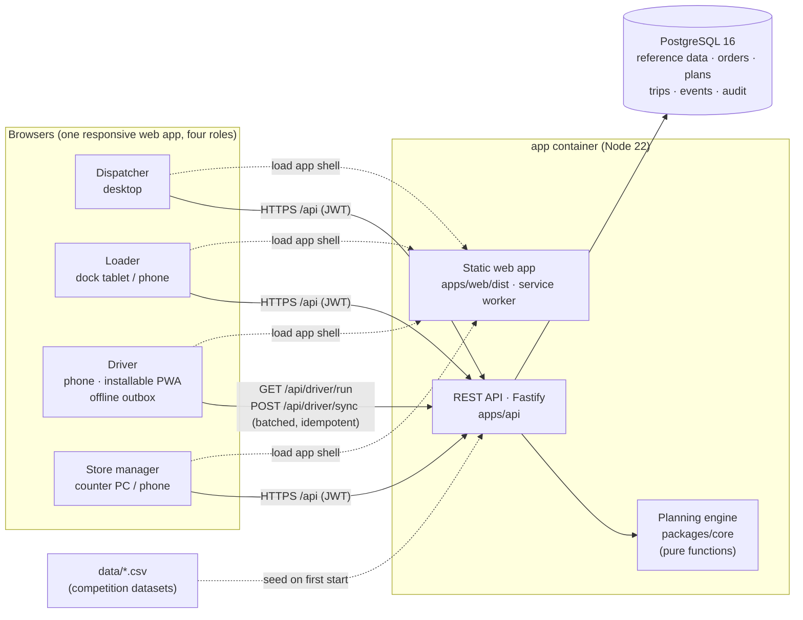
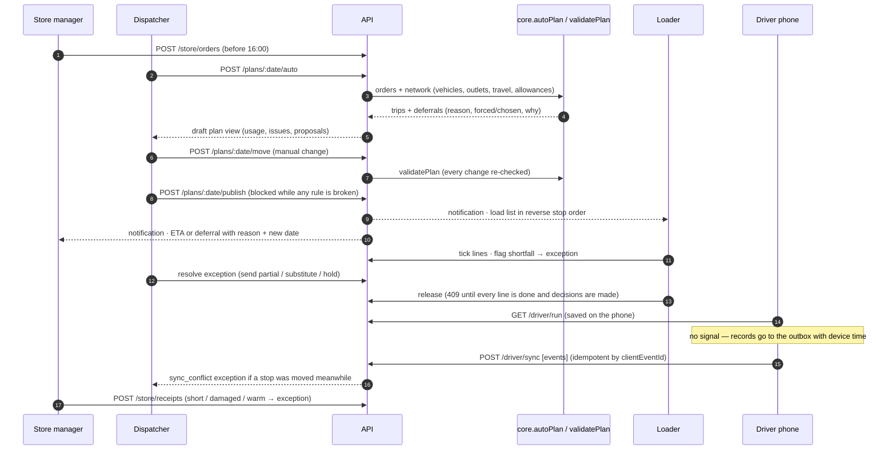

# Architecture

PathWise is one TypeScript monorepo with three parts and one database.

| Part | Path | What it does |
|---|---|---|
| Planning engine | `packages/core` | Pure, dependency-free domain logic: trip time formula, validation of every rule, the auto-planner and its deferral explanations, the deterministic demo day. Unit-tested without a database. |
| API | `apps/api` | Fastify 5 + `pg` (plain SQL, versioned migrations). Auth (JWT, bcrypt, dock PIN), role guards, business clock, plan drafts and publishing, loading, driver sync, exceptions and decisions, notifications, audit log. Serves the built web app in production. |
| Web | `apps/web` | React 19 + Vite + Tailwind v4, TanStack Query, React Router, Leaflet. One app, four role areas (`/d`, `/l`, `/r`, `/s`). The driver area is offline-first (service worker + IndexedDB outbox). |
| Database | PostgreSQL 16 | Reference data from the CSVs, operational data, append-only `stop_events` and `audit_log`. See [data-model.md](data-model.md). |

## Request flow for the core loop

## Key design decisions

**Planning engine is a pure library.** `packages/core` takes a `Network` object and a list of orders and returns trips and explained deferrals. The API, the tests and the capacity forecast all call the same functions, so the rules can never drift between what the planner produces, what the validator checks and what the dispatcher sees. See [planning-engine.md](planning-engine.md).

**Drafts and published plans.** A draft is a JSON document on the `plans` row; it can be edited, re-planned and discarded freely. Publishing validates it again on the server, then applies it to the `trips` / `trip_orders` tables in place so trip IDs stay stable for loaders and drivers. A republish marks changed trips (`changed_at`, `change_note`) and the loader must acknowledge before release. Trips already released or on the road are locked from re-planning.

**Business clock.** The demo day is Thu 30 Apr 2026. A settings row stores `{base, setAt}`; "now" is `base + (wall-clock − setAt)`, so time moves in real time from 02:30 and the dispatcher can jump it (e.g. to 05:55) for the walkthrough. Every client keeps the offset, so phones stamp offline records with business time.

**Offline driver.** The run is cached in IndexedDB on every successful fetch. Every action (start, arrive, deliver with photo and signature, problem, close) is written to an outbox first with a UUID and the device time, then sent in batches. The server applies each record exactly once (`stop_events.client_event_id` is unique), orders by device time, and never throws away a record: if the stop was moved while the phone was offline, the delivery is kept and flagged as a conflict for the dispatcher to decide. See [degradation.md](degradation.md).

**Notifications by audience.** A notification is addressed to `role:`, `depot:`, `outlet:`, `vehicle:` or `user:` and each user reads the union of their audiences. That keeps "tell the Kandy loaders" or "tell whoever drives VEH041" one insert, and it survives vehicle swaps.

**Audit.** Every write (plan moves, publish, loading, flags, releases, decisions, deliveries, receipts, clock changes) goes to `audit_log` with who and when.

## Deployment

One image (`Dockerfile`) builds the core, the API and the web app, and runs `node apps/api/dist/index.js`. On start it waits for PostgreSQL, applies migrations, seeds if the database is empty, and serves both `/api/*` and the web app. `docker-compose.yml` adds PostgreSQL 16 with a health check; `render.yaml` deploys the same image with a managed database.
