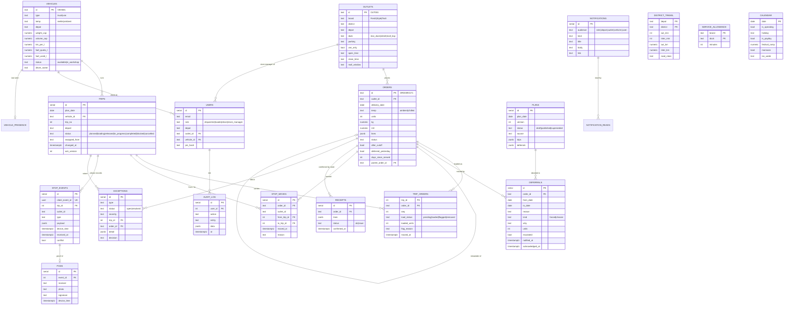

# Data model

PostgreSQL 16. Schema in [`apps/api/src/migrations/001_init.sql`](../apps/api/src/migrations/001_init.sql), applied by the API on start (`schema_migrations` tracks what ran).

## Tables in plain words

| Table | Holds | Notes |
|---|---|---|
| `outlets`, `vehicles`, `district_travel`, `service_allowance`, `calendar` | The five datasets | Loaded from `data/*.csv` on first start. `vehicles.status` and `fuel_used_l` change during operation. |
| `users` | Seeded accounts | bcrypt password; loaders also have a hashed 4-digit dock PIN scoped to a depot. |
| `orders` | Every store order | `after_cutoff` orders roll to the next operating day. `deferred_yesterday` and `days_since_served` drive planning priority. A shortfall or failed delivery creates a child order (`parent_order_id`) for the next run. |
| `plans` | Drafts and published versions | Trips and proposed deferrals stored as JSON while drafting; one `published` row per day, older ones `superseded`. |
| `trips`, `trip_orders` | The live plan | Stable IDs across republishes. `trip_orders` is also the load list (`load_status`, `loaded_units`, `flag_reason`). |
| `stop_moves` | Stops moved between live trips | Kept so a late-syncing phone can be detected as a conflict instead of overwriting the move. |
| `deferrals` | Orders moved to another day | `reason` is one of 11 codes with a plain-language store text; `kind` = **forced** (no vehicle could take it) or **chosen** (capacity went to higher-priority orders). `units` set when only part of an order moves. |
| `stop_events` | Everything the driver's phone recorded | Append-only. `client_event_id` makes sync idempotent. `device_time` is when it happened; `received_at` is when it arrived. |
| `pods` | Proof of delivery | Receiver name, photo and signature (data URLs, compressed on the phone). |
| `receipts` | Store's line-by-line check | Any line not OK raises a `receipt_issue` exception. |
| `exceptions` | Things that need a dispatcher decision | `dock_shortfall`, `vehicle_fault`, `non_delivery`, `sync_conflict`, `receipt_issue`, `road_problem`. The decision and who made it are stored. |
| `notifications`, `notification_reads` | In-app messages | Addressed to an audience, read state per user. |
| `audit_log` | Who did what, when | Every write. |
| `vehicle_presence` | Last contact per vehicle | Drives "no signal" on live tracking and the store's estimated ETA. |
| `settings` | `clock`, `plan_date` | The business clock and the active delivery day. |
