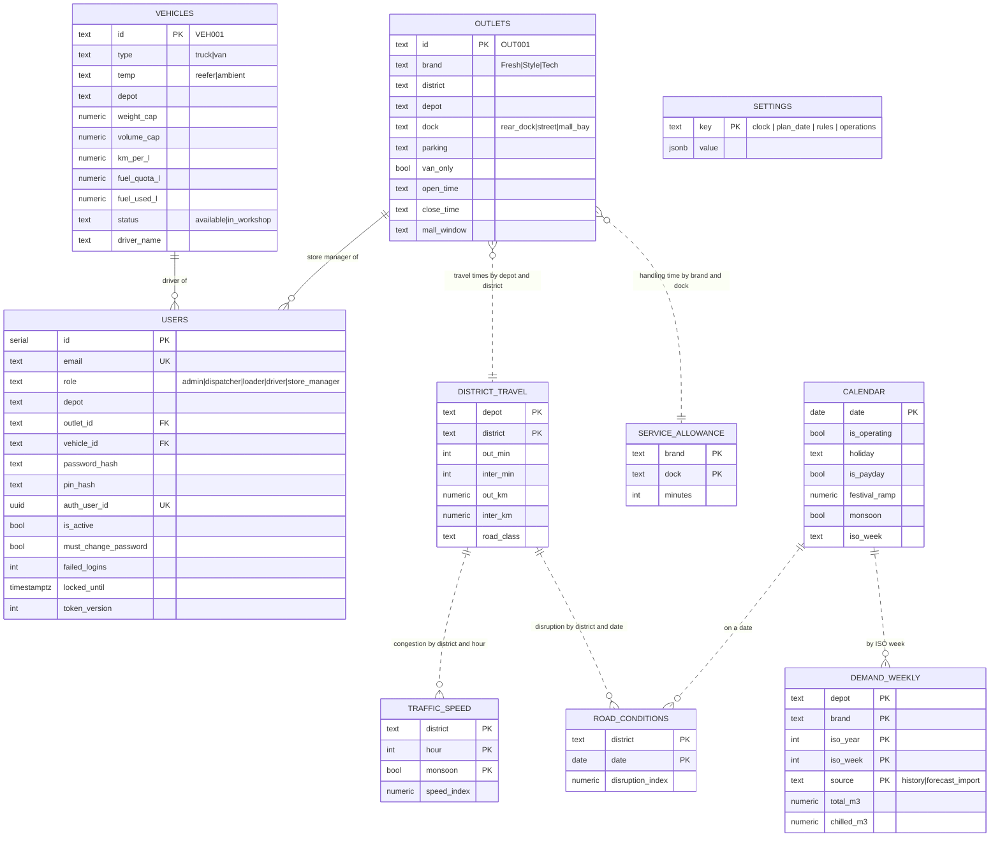
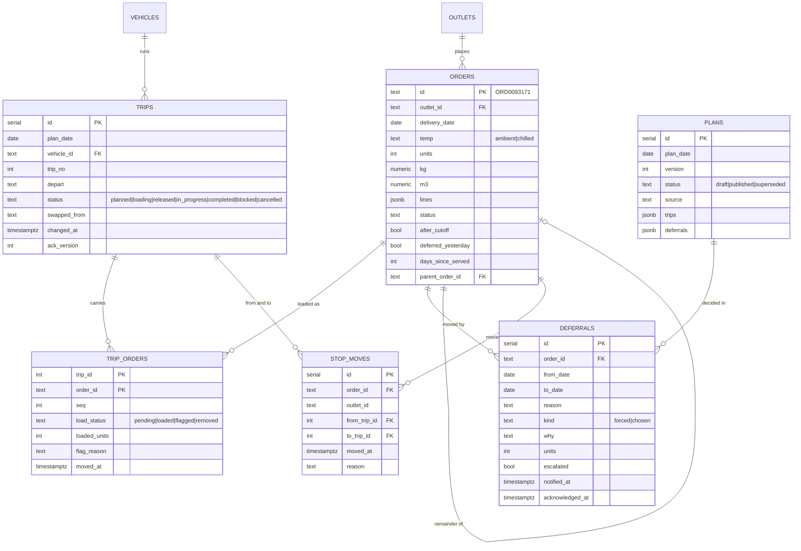
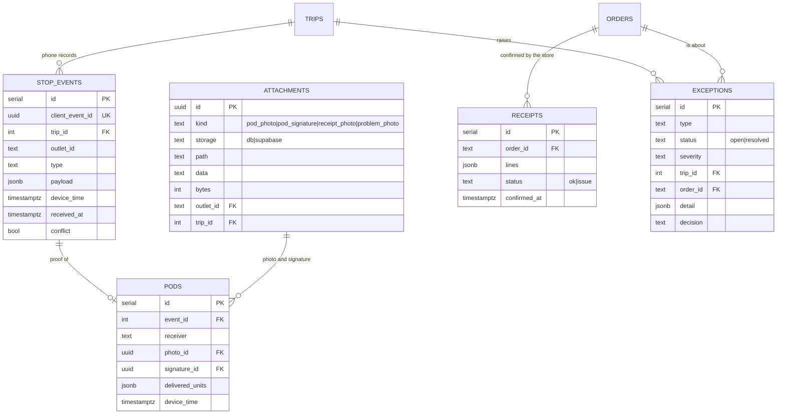
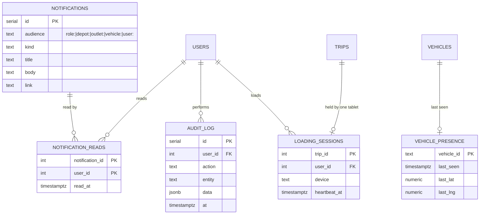

# Data model

PostgreSQL 16 (Compose, laptop or Supabase). Three versioned migrations, applied by the API on start or with `npm run db:migrate`; `schema_migrations` tracks what ran. The result is **26 application tables**, all with row-level security. The architecture view of where each kind of data lives is in [architecture.md, Figure 9](architecture.md#figure-9-data-architecture); the delivery entities at a glance are in [Figure 10](architecture.md#figure-10-domain-model-overview).

| Migration | Adds |
|---|---|
| [`001_init.sql`](../apps/api/src/migrations/001_init.sql) | Reference data, orders, plans, trips, loading, events, proofs, receipts, exceptions, notifications, audit |
| [`002_production.sql`](../apps/api/src/migrations/002_production.sql) | Admin role and account security, traffic, road-condition and weekly-demand tables, attachments, loading sessions, plan version stats, order edits and cancellation, check constraints, indexes, `updated_at` triggers, typed settings |
| [`003_security.sql`](../apps/api/src/migrations/003_security.sql) | Row-level security on every application table; on Supabase: no `anon` access, read-only policies per role via `pw_me()` and `pw_role()` |

## The four domain views

The model is shown in four views, one per part of the delivery loop. A table that belongs to another view appears only as the end of a relationship. Attributes are the main columns, not every column; `PK` is a primary key, `FK` a foreign key, `UK` a unique key.

### 1. Reference data and access

The five competition datasets, the two condition tables that turn plan times into expected times, the weekly demand history, and who may do what. Reference rows are loaded on first start; people are scoped to a depot, an outlet or a vehicle. Solid lines are foreign keys; dotted lines are joins by value (district, brand, dock, date) that the engine and the services make.

### 2. Orders and planning

What was ordered, how it was planned, and what was deferred. A draft plan is JSON on a `plans` row; publishing applies it to `trips` and `trip_orders` in place, so trip ids stay stable.

### 3. Execution and proof

What happened on the road and at the outlet: the phone's records, proof of delivery, the store's receipt and the exceptions that need a decision.

### 4. Communication, audit and presence

Who was told what, who did what, which tablet is loading a trip, and when each phone last made contact.

## Allowed values

The columns that hold a state or a kind are constrained in the database, so a typo cannot create a new state. Lifecycles are drawn in [Figures 11 and 12](architecture.md#figure-11-order-lifecycle).

| Column | Values |
|---|---|
| `users.role` | `admin`, `dispatcher`, `loader`, `driver`, `store_manager` |
| `vehicles.type` · `vehicles.status` | `truck`, `van` · `available`, `in_workshop` |
| `orders.status` | `confirmed`, `planned`, `deferred`, `loaded`, `out_for_delivery`, `delivered`, `partial`, `failed`, `received`, `disputed`, `cancelled` |
| `plans.status` | `draft`, `published`, `superseded` |
| `trips.status` | `planned`, `loading`, `released`, `in_progress`, `completed`, `cancelled`, `blocked` |
| `trip_orders.load_status` | `pending`, `loaded`, `flagged`, `removed` |
| `deferrals.kind` · `deferrals.reason` | `forced`, `chosen` · 11 reason codes (`capacity_volume`, `capacity_weight`, `no_reefer_capacity`, `no_van_capacity`, `vehicle_in_workshop`, `time_budget_exceeded`, `window_unreachable`, `fuel_quota`, `after_cutoff`, `dock_shortfall`, `other`) |
| `stop_events.type` | `trip_started`, `arrived`, `delivered`, `problem`, `trip_closed`, `conflict_answer`, `route_ack` |
| `receipts.status` | `ok`, `issue` |
| `exceptions.type` | `dock_shortfall`, `vehicle_fault`, `non_delivery`, `sync_conflict`, `receipt_issue`, `road_problem`, `size_divergence` |
| `exceptions.status` · `exceptions.severity` | `open`, `resolved` · `low`, `medium`, `high` |
| `attachments.kind` · `attachments.storage` | `pod_photo`, `pod_signature`, `receipt_photo`, `problem_photo` · `db`, `supabase` |
| `demand_weekly.source` | `history`, `forecast_import` |

## Integrity rules

| Rule | How it is enforced |
|---|---|
| Formats and ranges: HH:MM times, windows that open before they close, positive capacities, trip numbers 1 to 3, attachment size at most 5 MB | `CHECK` constraints |
| One draft and one published plan per day; one trip number per vehicle per day | Partial unique indexes on `plans`; `UNIQUE (plan_date, vehicle_id, trip_no)` on `trips` |
| A phone record is applied once, however often it is sent | `stop_events.client_event_id` is unique |
| One account per email (case-insensitive) and one Supabase user per account | A unique index on `lower(email)`; a unique `auth_user_id` |
| A dock PIN is unique per depot | Checked by the API when the PIN is set (PINs are bcrypt hashes, so the database cannot compare them) |
| History is never rewritten | `stop_events` and `audit_log` rows are only inserted; the single later change is a conflict flag on a stop event |
| Roles see only their scope | Checked in the services on every request, and by row-level security on the 26 application tables; on Supabase, `anon` has no access and nobody can write through the Data API |
| Files are private | Photos and signatures are served only through `/api/files/:id` after an access check; in Supabase Storage the bucket is private and links are signed |
| `updated_at` is always right | Triggers on the tables that have it |

## Tables in plain words

| Table | Holds | Notes |
|---|---|---|
| `outlets`, `vehicles`, `district_travel`, `service_allowance`, `calendar` | The five datasets | Loaded from `data/*.csv` on first start. `vehicles.status` and `fuel_used_l` change during operation. |
| `users` | People and access | Role + scope (depot / outlet / vehicle, enforced by a check constraint). bcrypt password, or `auth_user_id` when Supabase Auth checks passwords. Loaders have a hashed dock PIN unique per depot. `token_version` ends sessions; `failed_logins` / `locked_until` lock after 5 misses. |
| `traffic_speed`, `road_conditions` | Congestion by district/hour/monsoon and date-specific disruption | Turn free-flow travel times into expected arrival times. |
| `demand_weekly` | Weekly m³ by depot and brand | `history` from the training data; `forecast_import` from the Datathon Task 2A file uploaded in Admin → Data. |
| `attachments` | Photos and signatures | Bytes in the database (`storage=db`) or a path in the private Supabase bucket (`storage=supabase`). Served only through `/api/files/:id` after an access check. |
| `loading_sessions` | Which tablet is loading a trip | One loader per trip; heartbeat and take-over. |
| `orders` | Every store order | `after_cutoff` orders roll to the next operating day. `deferred_yesterday` and `days_since_served` drive planning priority. A shortfall or failed delivery creates a child order (`parent_order_id`) for the next run. |
| `plans` | Drafts and published versions | Trips and proposed deferrals stored as JSON while drafting; one `published` row per day, older ones `superseded`. |
| `trips`, `trip_orders` | The live plan | Stable IDs across republishes. `trip_orders` is also the load list (`load_status`, `loaded_units`, `flag_reason`). |
| `stop_moves` | Stops moved between live trips | Kept so a late-syncing phone can be detected as a conflict instead of overwriting the move. |
| `deferrals` | Orders moved to another day | `reason` is one of 11 codes with a plain-language store text; `kind` = **forced** (no vehicle could take it) or **chosen** (capacity went to higher-priority orders). `units` set when only part of an order moves. |
| `stop_events` | Everything the driver's phone recorded | Insert-only (the one later change is a conflict flag). `client_event_id` makes sync idempotent. `device_time` is when it happened; `received_at` is when it arrived. |
| `pods` | Proof of delivery | Receiver name, photo and signature (attachments), and the driver's count per order (`delivered_units`) so the store's count never overwrites it. |
| `receipts` | Store's line-by-line check | Any line not OK raises a `receipt_issue` exception. |
| `exceptions` | Things that need a dispatcher decision | `dock_shortfall`, `vehicle_fault`, `non_delivery`, `sync_conflict`, `receipt_issue`, `road_problem` (with `delayMin`), `size_divergence`. The decision and who made it are stored. |
| `notifications`, `notification_reads` | In-app messages | Addressed to an audience, read state per user. |
| `audit_log` | Who did what, when | Every write; insert-only. |
| `vehicle_presence` | Last contact per vehicle | Drives "no signal" on live tracking and the store's estimated ETA. |
| `settings` | `clock`, `plan_date`, `rules`, `operations` | The business clock, the active delivery day, the planning rules and operating settings (validated; edited in Admin → Settings). |

Row-level security is enabled on all 26 application tables (the migration-tracking table `schema_migrations` is excluded). Constraints guard formats and ranges (HH:MM times, windows that open before they close, positive capacities, one draft and one published plan per day, trip numbers 1–3, attachment size ≤ 5 MB).
